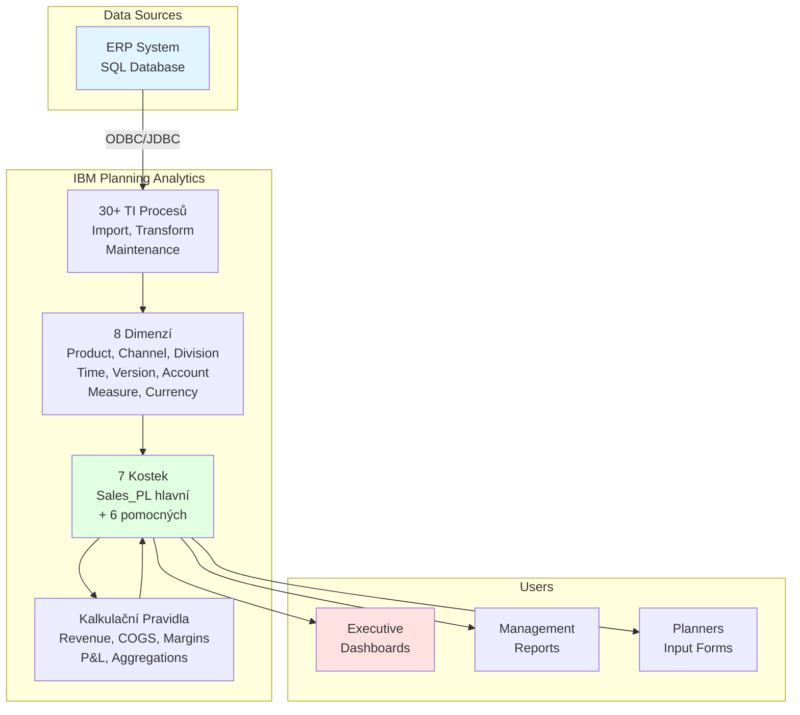

# Executive Summary - Planning Analytics Aplikace

## Přehled Projektu

**Název:** Planning Analytics - Finanční Plánování pro Prodej Elektroniky  
**Účel:** Centralizované finanční plánování, forecasting a P&L analýza  
**Platforma:** IBM Planning Analytics  
**Doba implementace:** 16 týdnů  
**Status:** ✅ Kompletní návrh připraven

---

## Business Case

### Současný Stav
- Manuální plánování v Excel
- Fragmentovaná data napříč systémy
- Časově náročný proces (4-6 týdnů)
- Omezená možnost scénářů
- Nízká přesnost forecastu

### Cílový Stav
- Automatizované plánování v PA
- Centralizovaná data
- Rychlý proces (1-2 týdny)
- Multi-scenario modeling
- Vysoká přesnost forecastu

### Očekávané Přínosy
- ⏱️ **Časové úspory:** 50% redukce plánovacího cyklu
- 📊 **Přesnost:** 20% zlepšení forecast accuracy
- 💰 **ROI:** Pozitivní do 12 měsíců
- 👥 **Produktivita:** 30% zvýšení produktivity plannerů
- 📈 **Insights:** Real-time business intelligence

---

## Řešení Overview

### Architektura na Jedné Stránce



---

## Klíčové Komponenty

### 1. Datový Model

**8 Dimenzí:**
| Dimenze | Elementy | Účel |
|---------|----------|------|
| Product | ~100 | Produktové portfolio |
| Channel | ~20 | Prodejní kanály |
| Division | ~15 | Organizační struktura |
| Time | 102 | Měsíce 2025-2030 |
| Version | 6 | Actual + scénáře |
| Account | ~60 | P&L struktura |
| Measure | 8 | Metriky |
| Currency | 3 | CZK, EUR, USD |

**7 Kostek:**
- Sales_PL (hlavní) - ~2-5M buněk
- Product_Master, Channel_Master
- FX_Rates, Assumptions
- Allocation_Rules, Data_Quality

**Celková velikost:** ~100-150 MB v paměti

---

### 2. Business Logika

**Automatické Kalkulace:**
```
Revenue = Quantity × Price
COGS = Quantity × Cost
Gross Margin = Revenue - COGS
EBITDA = Gross Margin - OPEX
EBIT = EBITDA - Depreciation
```

**Časové Agregace:**
```
Měsíc → Kvartál → Rok
```

**Scénáře:**
- Actual (skutečnost)
- Budget (plán)
- Forecast (Actual YTD + Plan)
- Best Case / Most Likely / Worst Case

---

### 3. Integrace

**Zdroj Dat:**
- ERP System (SQL Database)
- ODBC/JDBC připojení
- Denní import Actual dat
- Měsíční import OPEX/CAPEX

**Datové Toky:**
```
SQL → TI Process → Dimensions → Cubes → Rules → Reports
```

---

### 4. Bezpečnost

**5 Rolí:**
1. **ADMIN** - Plný přístup
2. **FINANCE_CONTROLLER** - Oversight
3. **PLANNER** - Vytváření plánů
4. **MANAGER** - Reporting
5. **VIEWER** - Základní přístup

**Multi-layer Security:**
- Authentication (LDAP/AD)
- Cube security
- Dimension security
- Cell security
- Process security

---

### 5. Reporting

**3 Úrovně:**

**Executive Dashboards:**
- P&L Overview
- Sales Performance
- Financial Planning Status

**Management Reports:**
- Detailed P&L Statement
- Division Performance
- Product/Channel Analysis

**Operational Reports:**
- Data Input Status
- Variance Analysis
- Forecast Accuracy

---

## Implementační Roadmap

### 16-týdenní Plán

```
Týdny 1-3:   PŘÍPRAVA
             ├─ Kick-off
             ├─ Infrastruktura
             └─ Training

Týdny 4-9:   VÝVOJ
             ├─ Dimenze & Kostky
             ├─ Rules
             └─ TI Procesy

Týdny 10-11: BEZPEČNOST & REPORTING
             ├─ Security Setup
             └─ Dashboards & Reports

Týdny 12-14: TESTOVÁNÍ
             ├─ Unit Testing
             ├─ Integration Testing
             └─ UAT

Týdny 15-16: NASAZENÍ
             ├─ Production Deployment
             ├─ Go-Live
             └─ Hypercare
```

### Klíčové Milníky

| Týden | Milestone | Deliverable |
|-------|-----------|-------------|
| 1 | Kick-off | Project charter |
| 3 | Infrastructure Ready | DEV/UAT/PROD prostředí |
| 9 | Development Complete | Všechny komponenty |
| 14 | UAT Complete | UAT sign-off |
| 15 | Go-Live | Production system |
| 16 | Project Close | Handover to BAU |

---

## Technické Specifikace

### Výkon
- **Query Response:** <2 sekundy
- **Process Execution:** <30 minut
- **Report Generation:** <10 sekund
- **Concurrent Users:** 50+
- **System Availability:** >99.5%

### Kapacita
- **Data Storage:** ~100-150 MB
- **Historical Data:** 6 let
- **Planning Horizon:** 6 let (2025-2030)
- **Granularity:** Měsíční

### Škálovatelnost
- Horizontální scaling možné
- Archive strategy pro stará data
- Partition strategy pro velké kostky
- Growth capacity: 3× current size

---

## Risk Management

### Top 5 Rizik

| Riziko | Pravděpodobnost | Dopad | Mitigation |
|--------|-----------------|-------|------------|
| Infrastruktura delay | Střední | Vysoký | Early start, backup |
| Data quality issues | Vysoká | Střední | Data profiling |
| Scope creep | Střední | Střední | Change control |
| Resource availability | Střední | Vysoký | Backup resources |
| User adoption | Střední | Střední | Training, change mgmt |

### Contingency Plans
- **Plán A:** Standard (16 týdnů)
- **Plán B:** Phased (20 týdnů)
- **Plán C:** MVP (12 týdnů)

---

## Success Criteria

### Technical Success
✅ System availability >99.5%  
✅ Query response <2s  
✅ All calculations accurate  
✅ Security working  
✅ No critical bugs  

### Business Success
✅ User adoption >80%  
✅ Planning cycle -50%  
✅ Forecast accuracy +20%  
✅ User satisfaction >4/5  
✅ ROI positive in 12 months  

### Project Success
✅ On-time delivery  
✅ Within budget  
✅ All requirements met  
✅ Stakeholder satisfaction >4/5  

---

## Resource Requirements

### Projektový Tým
- Project Manager: 100% (16 týdnů)
- Solution Architect: 100% (16 týdnů)
- TM1 Developers: 3× 100% (12 týdnů)
- Business Analyst: 50% (16 týdnů)
- QA Engineer: 100% (6 týdnů)
- IT Infrastructure: 50% (4 týdny)
- DBA: 25% (4 týdny)

**Total Effort:** ~60 person-weeks

### Budget Kategorie
- Software licenses
- Hardware (servers, storage)
- Professional services
- Training
- Contingency (10%)

---

## Next Steps

### Immediate Actions (Week 1)
1. ✅ Review a schválení návrhu
2. ⬜ Sestavení projektového týmu
3. ⬜ Kick-off meeting
4. ⬜ Příprava infrastruktury

### Short-term (Weeks 2-4)
1. ⬜ Setup prostředí
2. ⬜ Team training
3. ⬜ Start development

### Medium-term (Weeks 5-14)
1. ⬜ Complete development
2. ⬜ Testing
3. ⬜ UAT

### Long-term (Weeks 15-16)
1. ⬜ Production deployment
2. ⬜ Go-live
3. ⬜ Hypercare support

---

## Dokumentace

### Kompletní Dokumentace
1. **[Business Requirements](01_Business_Requirements.md)** - Detailní požadavky
2. **[Dimensional Model](02_Dimensional_Model.md)** - Dimenze a hierarchie
3. **[Cube Design](03_Cube_Design.md)** - Kostky a struktura
4. **[Rules Design](04_Rules_Design.md)** - Kalkulační pravidla
5. **[TI Processes](05_TurboIntegrator_Processes.md)** - Import a transformace
6. **[Architecture](06_Architecture_Overview.md)** - Celková architektura
7. **[Security Model](07_Security_Model.md)** - Bezpečnost
8. **[Reports & Dashboards](08_Reports_and_Dashboards.md)** - Reporting
9. **[Implementation Plan](09_Implementation_Plan.md)** - Implementační plán

### Dodatečné Materiály
- User guides
- Training materials
- Technical specifications
- API documentation
- Troubleshooting guides

---

## Kontakt

### Projektový Tým
- **Project Manager:** [Jméno]
- **Solution Architect:** [Jméno]
- **Lead Developer:** [Jméno]

### Stakeholders
- **Sponsor:** [Jméno]
- **Business Owner:** [Jméno]
- **IT Lead:** [Jméno]

---

## Závěr

Tento návrh poskytuje kompletní, production-ready řešení pro finanční plánování v IBM Planning Analytics. Řešení je:

✅ **Kompletní** - Všechny komponenty navrženy  
✅ **Škálovatelné** - Připraveno na růst  
✅ **Bezpečné** - Multi-layer security  
✅ **Výkonné** - Optimalizováno pro rychlost  
✅ **Flexibilní** - Snadná údržba a rozšíření  
✅ **Dokumentované** - Kompletní dokumentace  

**Status:** ✅ Připraveno k implementaci

**Doporučení:** Schválit návrh a zahájit implementaci podle plánu.

---

*Dokument vytvořen: 2025-01-01*  
*Verze: 1.0*  
*Status: Final*