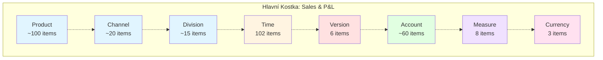

# Dimenzionální Model - Planning Analytics

## Přehled Dimenzí

Aplikace bude obsahovat následující dimenze:

### 1. Dimenze: **Product** (Produkty)

**Typ:** Standardní dimenze  
**Účel:** Kategorizace produktového portfolia

**Hierarchie:**
```
Total Products
├── Mobile Phones
│   ├── Smartphone Premium
│   ├── Smartphone Standard
│   └── Feature Phones
├── Computers
│   ├── Desktop PC
│   └── All-in-One PC
├── Tablets
│   ├── Tablet Premium
│   └── Tablet Standard
├── Notebooks
│   ├── Notebook Premium
│   ├── Notebook Standard
│   └── Ultrabook
└── Accessories
    ├── Cases & Covers
    ├── Chargers
    ├── Headphones
    └── Other Accessories
```

**Atributy:**
- Product_Code (text)
- Product_Name (text)
- Category (text)
- Active_Flag (text: Y/N)

**Počet elementů:** ~50-100 produktů

---

### 2. Dimenze: **Channel** (Prodejní Kanály)

**Typ:** Standardní dimenze  
**Účel:** Sledování prodejů podle distribučních kanálů

**Hierarchie:**
```
Total Channels
├── Direct Sales
│   ├── Flagship Stores
│   ├── Standard Stores
│   └── Pop-up Stores
├── Partner Sales
│   ├── Authorized Dealers
│   ├── Retail Chains
│   └── Wholesale Partners
└── Online Sales
    ├── Company Website
    ├── Marketplace Platforms
    └── Mobile App
```

**Atributy:**
- Channel_Code (text)
- Channel_Name (text)
- Channel_Type (text)
- Default_Margin_Pct (numeric)

**Počet elementů:** ~15-20 kanálů

---

### 3. Dimenze: **Division** (Divize/Obchodní Jednotky)

**Typ:** Standardní dimenze  
**Účel:** Organizační struktura společnosti

**Hierarchie:**
```
Total Company
├── Consumer Electronics Division
│   ├── Mobile Business Unit
│   └── Computing Business Unit
├── Enterprise Solutions Division
│   ├── B2B Sales Unit
│   └── Corporate Solutions Unit
└── E-commerce Division
    ├── Online Retail Unit
    └── Digital Marketing Unit
```

**Atributy:**
- Division_Code (text)
- Division_Name (text)
- Manager (text)
- Cost_Center (text)

**Počet elementů:** ~10-15 divizí

---

### 4. Dimenze: **Time** (Čas)

**Typ:** Časová dimenze  
**Účel:** Časové období plánování a reportingu

**Hierarchie:**
```
Total Time
├── 2025
│   ├── Q1 2025
│   │   ├── Jan 2025
│   │   ├── Feb 2025
│   │   └── Mar 2025
│   ├── Q2 2025
│   │   ├── Apr 2025
│   │   ├── May 2025
│   │   └── Jun 2025
│   ├── Q3 2025
│   │   ├── Jul 2025
│   │   ├── Aug 2025
│   │   └── Sep 2025
│   └── Q4 2025
│       ├── Oct 2025
│       ├── Nov 2025
│       └── Dec 2025
├── 2026
│   └── [stejná struktura]
├── 2027
├── 2028
├── 2029
└── 2030
```

**Atributy:**
- Period_Code (text)
- Period_Name (text)
- Year (numeric)
- Quarter (numeric)
- Month (numeric)
- Period_Type (text: Month/Quarter/Year)

**Počet elementů:** 72 měsíců + 24 kvartálů + 6 roků = 102 elementů

---

### 5. Dimenze: **Version** (Verze/Scénáře)

**Typ:** Standardní dimenze  
**Účel:** Různé scénáře plánování a skutečnost

**Struktura (plochá):**
```
├── Actual
├── Budget
├── Forecast
├── Best_Case
├── Most_Likely
└── Worst_Case
```

**Atributy:**
- Version_Code (text)
- Version_Name (text)
- Version_Type (text: Actual/Plan)
- Editable_Flag (text: Y/N)
- Description (text)

**Počet elementů:** 6 verzí

---

### 6. Dimenze: **Account** (Účty P&L)

**Typ:** Standardní dimenze s kalkulacemi  
**Účel:** Struktura Profit & Loss výkazu

**Hierarchie:**
```
Net_Income
├── Revenue
│   ├── Gross_Revenue
│   │   ├── Product_Revenue (C)
│   │   └── Other_Revenue (I)
│   └── Revenue_Adjustments (I)
│       ├── Returns (I)
│       └── Discounts (I)
├── COGS
│   ├── Product_COGS (C)
│   ├── Freight_Costs (I)
│   └── Warehousing_Costs (I)
├── Gross_Margin (C: Revenue - COGS)
├── Operating_Expenses
│   ├── Personnel_Costs
│   │   ├── Salaries (I)
│   │   ├── Benefits (I)
│   │   └── Training (I)
│   ├── Facility_Costs
│   │   ├── Rent (I)
│   │   ├── Utilities (I)
│   │   └── Maintenance (I)
│   ├── Marketing_Costs
│   │   ├── Advertising (I)
│   │   ├── Promotions (I)
│   │   └── Digital_Marketing (I)
│   ├── IT_Costs
│   │   ├── Software_Licenses (I)
│   │   ├── IT_Services (I)
│   │   └── Hardware_Maintenance (I)
│   └── Other_OPEX
│       ├── Professional_Services (I)
│       ├── Insurance (I)
│       └── Other_Expenses (I)
├── EBITDA (C: Gross_Margin - Operating_Expenses)
├── Depreciation (I)
├── EBIT (C: EBITDA - Depreciation)
└── CAPEX (sledováno samostatně)
    ├── IT_Infrastructure (I)
    ├── Store_Equipment (I)
    ├── Warehouse_Equipment (I)
    └── Other_CAPEX (I)
```

**Legenda:**
- (C) = Calculated (vypočítáno pravidly)
- (I) = Input (vstupní hodnota)

**Atributy:**
- Account_Code (text)
- Account_Name (text)
- Account_Type (text: Revenue/Expense/Asset)
- Calculation_Type (text: Input/Calculated)
- Sign (text: +/-)
- Report_Category (text)

**Počet elementů:** ~50-60 účtů

---

### 7. Dimenze: **Measure** (Metriky)

**Typ:** Standardní dimenze  
**Účel:** Různé typy metrik a kalkulací

**Struktura (plochá):**
```
├── Amount (Částka v CZK)
├── Quantity (Množství kusů)
├── Price (Cena za kus)
├── Cost (Náklad za kus)
├── Margin_Pct (Marže v %)
├── Growth_Rate (Růst v %)
├── FX_Rate (Směnný kurz)
└── Headcount (Počet zaměstnanců)
```

**Atributy:**
- Measure_Code (text)
- Measure_Name (text)
- Unit (text)
- Decimals (numeric)
- Format (text)

**Počet elementů:** 8 metrik

---

### 8. Dimenze: **Currency** (Měna)

**Typ:** Standardní dimenze  
**Účel:** Multi-currency reporting (budoucí rozšíření)

**Struktura (plochá):**
```
├── CZK (Česká koruna - základní měna)
├── EUR (Euro)
└── USD (US Dollar)
```

**Atributy:**
- Currency_Code (text)
- Currency_Name (text)
- Symbol (text)
- Is_Base_Currency (text: Y/N)

**Počet elementů:** 3 měny (s možností rozšíření)

---

## Vztahy mezi Dimenzemi

### Primární Vztahy:

1. **Product × Channel × Division**
   - Každý produkt může být prodáván přes různé kanály
   - Každá divize může prodávat různé produkty přes různé kanály

2. **Account × Measure**
   - Revenue účty: Amount, Quantity, Price
   - COGS účty: Amount, Quantity, Cost
   - OPEX účty: Amount
   - CAPEX účty: Amount

3. **Time × Version**
   - Actual: pouze historická data
   - Budget/Forecast: budoucí období
   - Scénáře: všechna období

### Kalkulační Vztahy:

```
Revenue (Amount) = Quantity × Price
COGS (Amount) = Quantity × Cost
Gross_Margin = Revenue - COGS
Margin_Pct = (Gross_Margin / Revenue) × 100
```

---

## Dimenzionální Diagram



---

## Velikost Datového Modelu

### Teoretická Velikost Kostky:
```
100 (Product) × 
20 (Channel) × 
15 (Division) × 
102 (Time) × 
6 (Version) × 
60 (Account) × 
8 (Measure) × 
3 (Currency)
= ~2.2 miliardy buněk
```

### Reálná Velikost (s řídkostí):
- Očekávaná řídkost: ~99.9%
- Reálně obsazené buňky: ~2-5 milionů
- Velikost v paměti: ~50-100 MB

---

## Naming Conventions

### Dimenze:
- Formát: `PascalCase`
- Příklad: `Product`, `Channel`, `Division`

### Elementy:
- Formát: `Snake_Case` nebo `Kebab-Case`
- Příklad: `Mobile_Phones`, `Direct-Sales`

### Hierarchie:
- Konsolidace: `Total_[Dimension]`
- Příklad: `Total_Products`, `Total_Channels`

### Atributy:
- Formát: `Snake_Case`
- Příklad: `Product_Code`, `Channel_Name`

---

## Doporučení pro Implementaci

1. **Pořadí vytváření dimenzí:**
   - Currency (nejjednodušší)
   - Measure
   - Version
   - Time (s automatickým generováním)
   - Product
   - Channel
   - Division
   - Account (poslední, nejkomplexnější)

2. **Optimalizace:**
   - Použít aliasy pro často používané elementy
   - Implementovat atributy pro rychlé filtrování
   - Zvážit použití subsetů pro velké dimenze

3. **Údržba:**
   - Pravidelná kontrola nepoužívaných elementů
   - Verzování změn v hierarchiích
   - Dokumentace business pravidel pro každou dimenzi