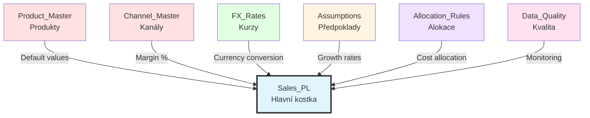

# Návrh Datových Kostek - Planning Analytics

## Přehled Kostek

Aplikace bude obsahovat následující kostky (cubes):

---

## 1. Hlavní Kostka: **Sales_PL** (Sales & Profit/Loss)

### Účel
Hlavní transakční kostka pro sledování prodejů, nákladů a P&L výpočty.

### Dimenze
1. Product
2. Channel
3. Division
4. Time
5. Version
6. Account
7. Measure
8. Currency

### Struktura
```
Sales_PL [Product, Channel, Division, Time, Version, Account, Measure, Currency]
```

### Velikost
- Teoretická: ~2.2 miliard buněk
- Reálná (s řídkostí): ~2-5 milionů buněk
- Paměť: ~50-100 MB

### Typy Dat
- **Input buňky:** 
  - Quantity (množství prodeje)
  - Price (prodejní cena)
  - Cost (pořizovací cena)
  - OPEX částky
  - CAPEX částky

- **Calculated buňky:**
  - Revenue Amount = Quantity × Price
  - COGS Amount = Quantity × Cost
  - Gross Margin = Revenue - COGS
  - Margin % = (Gross Margin / Revenue) × 100
  - EBITDA, EBIT, Net Income

### Pravidla (Rules)
- Kalkulace tržeb z množství a ceny
- Kalkulace COGS z množství a nákladů
- P&L agregace a konsolidace
- Časové agregace (měsíc → kvartál → rok)

### Feeder Statements
```
# Feed z Quantity a Price do Revenue Amount
['Quantity'] => ['Amount'];
['Price'] => ['Amount'];

# Feed z Quantity a Cost do COGS Amount
['Cost'] => ['Amount'];

# Feed z Revenue a COGS do Gross Margin
['Revenue'] => ['Gross_Margin'];
['COGS'] => ['Gross_Margin'];
```

---

## 2. Pomocná Kostka: **Product_Master** (Produktový Kmenový Soubor)

### Účel
Správa produktových atributů a parametrů.

### Dimenze
1. Product
2. Product_Attribute
3. Version (pro historii změn)

### Struktura
```
Product_Master [Product, Product_Attribute, Version]
```

### Product_Attribute elementy
- Product_Code
- Product_Name
- Category
- Subcategory
- Default_Price
- Default_Cost
- Standard_Margin_Pct
- Active_Flag
- Launch_Date
- EOL_Date (End of Life)
- Supplier
- Lead_Time_Days

### Velikost
- ~100 produktů × 12 atributů × 6 verzí = ~7,200 buněk
- Paměť: <1 MB

### Použití
- Reference data pro hlavní kostku
- Lookup pro defaultní hodnoty
- Audit trail změn produktových parametrů

---

## 3. Pomocná Kostka: **Channel_Master** (Kmenový Soubor Kanálů)

### Účel
Správa parametrů prodejních kanálů.

### Dimenze
1. Channel
2. Channel_Attribute
3. Version

### Struktura
```
Channel_Master [Channel, Channel_Attribute, Version]
```

### Channel_Attribute elementy
- Channel_Code
- Channel_Name
- Channel_Type
- Default_Margin_Pct
- Commission_Pct
- Active_Flag
- Cost_Per_Transaction
- Min_Order_Value

### Velikost
- ~20 kanálů × 8 atributů × 6 verzí = ~960 buněk
- Paměť: <1 MB

---

## 4. Pomocná Kostka: **FX_Rates** (Směnné Kurzy)

### Účel
Správa směnných kurzů pro multi-currency reporting.

### Dimenze
1. Currency (From)
2. Currency (To)
3. Time
4. Rate_Type (Average, Period_End, Budget)

### Struktura
```
FX_Rates [Currency_From, Currency_To, Time, Rate_Type]
```

### Velikost
- 3 × 3 × 102 × 3 = ~2,754 buněk
- Paměť: <1 MB

### Použití
- Konverze mezi měnami
- Historické kurzy pro Actual data
- Plánované kurzy pro Budget/Forecast

---

## 5. Pomocná Kostka: **Assumptions** (Plánovací Předpoklady)

### Účel
Centrální úložiště plánovacích předpokladů a parametrů.

### Dimenze
1. Assumption_Category
2. Assumption_Item
3. Time
4. Version

### Struktura
```
Assumptions [Assumption_Category, Assumption_Item, Time, Version]
```

### Assumption_Category elementy
- Growth_Rates
  - Revenue_Growth_Pct
  - Volume_Growth_Pct
  - Price_Inflation_Pct
  - Cost_Inflation_Pct
  
- Market_Assumptions
  - Market_Share_Pct
  - Market_Size
  - Competition_Index
  
- Cost_Drivers
  - Salary_Increase_Pct
  - Rent_Increase_Pct
  - Marketing_Budget_Pct_Revenue
  
- Financial_Ratios
  - Target_Gross_Margin_Pct
  - Target_EBITDA_Margin_Pct
  - CAPEX_Pct_Revenue

### Velikost
- 4 kategorie × 15 položek × 102 období × 6 verzí = ~36,720 buněk
- Paměť: ~2 MB

### Použití
- Driver-based planning
- Scenario modeling
- Sensitivity analysis

---

## 6. Pomocná Kostka: **Allocation_Rules** (Alokační Pravidla)

### Účel
Definice pravidel pro alokaci nákladů mezi divize/produkty.

### Dimenze
1. Cost_Pool (nákladové středisko)
2. Allocation_Base (alokační báze)
3. Target_Dimension (Product/Division/Channel)
4. Target_Element

### Struktura
```
Allocation_Rules [Cost_Pool, Allocation_Base, Target_Dimension, Target_Element]
```

### Allocation_Base elementy
- Revenue_Based
- Headcount_Based
- Square_Meter_Based
- Transaction_Based
- Equal_Split

### Velikost
- ~50 cost pools × 5 bases × 3 dimensions × 100 targets = ~75,000 buněk
- Paměť: ~3 MB

### Použití
- Alokace režijních nákladů
- Cost center accounting
- Profitability analysis

---

## 7. Kontrolní Kostka: **Data_Quality** (Kvalita Dat)

### Účel
Sledování kvality a úplnosti dat.

### Dimenze
1. Data_Source
2. Quality_Metric
3. Time
4. Status

### Struktura
```
Data_Quality [Data_Source, Quality_Metric, Time, Status]
```

### Quality_Metric elementy
- Record_Count
- Null_Values_Count
- Duplicate_Count
- Validation_Errors
- Last_Update_Timestamp
- Data_Completeness_Pct

### Velikost
- 10 sources × 6 metrics × 102 periods × 3 statuses = ~18,360 buněk
- Paměť: ~1 MB

---

## Vztahy mezi Kostkami



---

## Datové Toky

### 1. Import Actual Data
```
SQL Database → TI Process → Sales_PL [Actual version]
                         → Product_Master
                         → Channel_Master
                         → Data_Quality
```

### 2. Planning Process
```
User Input → Sales_PL [Budget/Forecast versions]
Assumptions → Driver calculations → Sales_PL
Product_Master → Default values → Sales_PL
```

### 3. Consolidation
```
Sales_PL [Month level] → Rules → Sales_PL [Quarter level]
Sales_PL [Quarter level] → Rules → Sales_PL [Year level]
```

### 4. Reporting
```
Sales_PL → Views/Subsets → Reports
Sales_PL + Assumptions → Variance Analysis
Sales_PL [Multiple versions] → Scenario Comparison
```

---

## Optimalizace Kostek

### 1. Sparse Consolidation
- Dimenze s vysokou řídkostí: Product, Channel, Division
- Dimenze s nízkou řídkostí: Time, Version, Account, Measure

### Doporučené nastavení:
```
SPARSE: Product, Channel, Division
DENSE: Time, Version, Account, Measure, Currency
```

### 2. Feeder Optimization
- Minimalizovat počet feederů
- Používat conditional feeders kde možné
- Pravidelně kontrolovat feeder statistics

### 3. Rule Performance
- Používat SKIPCHECK kde vhodné
- Minimalizovat DB funkce v pravidlech
- Cachovat často používané hodnoty

### 4. Memory Management
- Pravidelné SaveDataAll
- Monitoring memory usage
- Archivace starých dat

---

## Naming Conventions pro Kostky

### Formát názvu kostky:
```
[Purpose]_[Type]
```

Příklady:
- `Sales_PL` - hlavní transakční kostka
- `Product_Master` - kmenový soubor
- `FX_Rates` - pomocná kostka
- `Data_Quality` - kontrolní kostka

### Formát názvu view:
```
[Cube]_[Purpose]_[User/Role]
```

Příklady:
- `Sales_PL_Input_Planner`
- `Sales_PL_Report_Manager`
- `Sales_PL_Analysis_Controller`

---

## Bezpečnost na Úrovni Kostek

### Přístupová Práva:

**Sales_PL kostka:**
- ADMIN: Plný přístup
- WRITE: Plánování (Budget/Forecast verze)
- READ: Reporting (všechny verze)
- NONE: Žádný přístup

**Master Data kostky:**
- ADMIN: IT administrátoři
- WRITE: Data stewards
- READ: Všichni uživatelé

**Control kostky:**
- ADMIN: IT administrátoři
- READ: Auditoři, kontroloři

---

## Monitoring a Údržba

### Pravidelné Úkoly:

**Denně:**
- Kontrola velikosti kostek
- Monitoring feeder activity
- Kontrola rule performance

**Týdně:**
- Analýza růstu dat
- Cleanup nepoužívaných buněk
- Backup kostek

**Měsíčně:**
- Optimalizace pravidel
- Review security settings
- Archivace starých dat

**Kvartálně:**
- Kompletní restrukturalizace
- Performance tuning
- Capacity planning

---

## Doporučení pro Implementaci

### Fáze 1: Core Cubes
1. Sales_PL (hlavní kostka)
2. Product_Master
3. Channel_Master

### Fáze 2: Supporting Cubes
4. Assumptions
5. FX_Rates

### Fáze 3: Advanced Features
6. Allocation_Rules
7. Data_Quality

### Testovací Strategie:
1. Unit testing jednotlivých pravidel
2. Integration testing mezi kostkami
3. Performance testing s plným objemem dat
4. User acceptance testing

### Rollout:
1. Pilot s omezenou skupinou uživatelů
2. Postupné rozšíření na všechny divize
3. Monitoring a optimalizace
4. Full production deployment