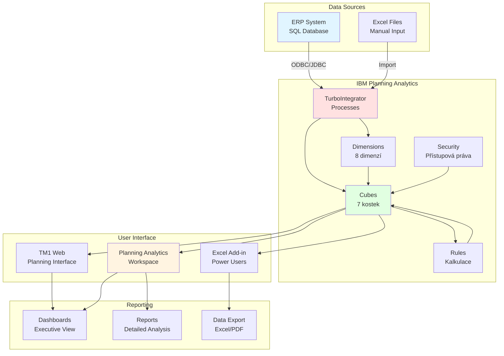
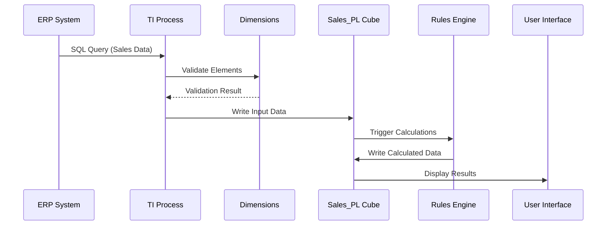
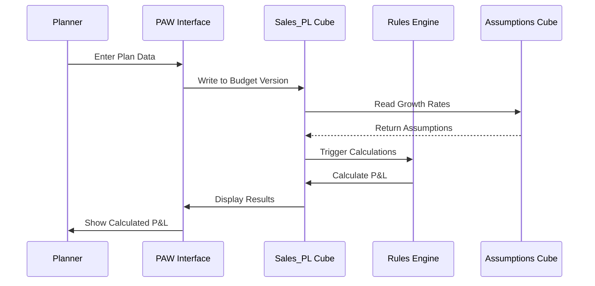
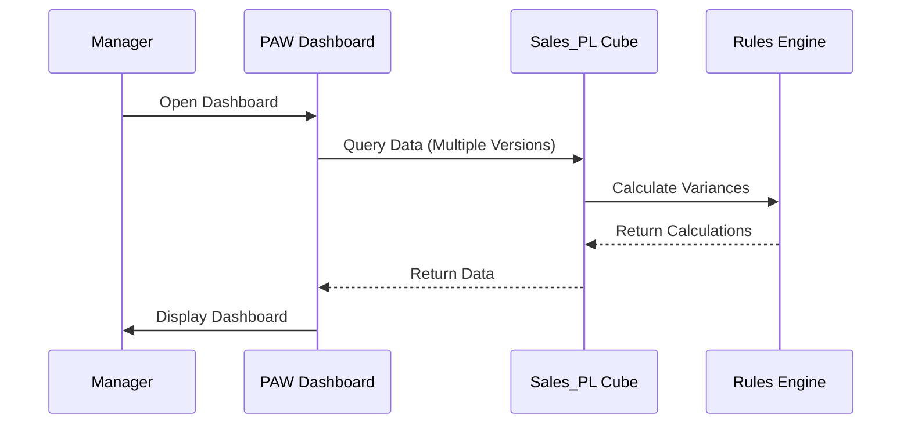
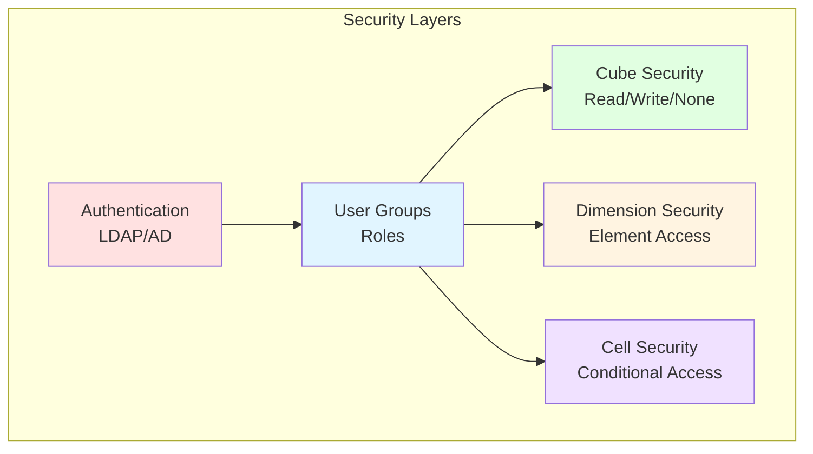
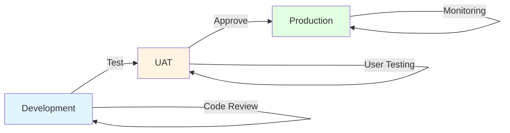

# Architektura Řešení - Planning Analytics Aplikace

## Executive Summary

Tento dokument poskytuje kompletní přehled architektury aplikace pro finanční plánování a forecast v IBM Planning Analytics pro společnost zabývající se prodejem elektroniky.

---

## 1. Architektonický Přehled

### 1.1 Celková Architektura



---

## 2. Komponenty Systému

### 2.1 Data Layer (Datová Vrstva)

#### Dimenze (8 dimenzí)
1. **Product** - ~100 elementů
   - Hierarchie: Total → Category → Subcategory → Product
   
2. **Channel** - ~20 elementů
   - Hierarchie: Total → Channel Type → Channel
   
3. **Division** - ~15 elementů
   - Hierarchie: Total → Division → Business Unit
   
4. **Time** - 102 elementů
   - Hierarchie: Total → Year → Quarter → Month
   - Období: 2025-2030
   
5. **Version** - 6 elementů
   - Actual, Budget, Forecast, Best_Case, Most_Likely, Worst_Case
   
6. **Account** - ~60 elementů
   - Hierarchie P&L: Revenue → COGS → Gross Margin → OPEX → EBITDA → EBIT → Net Income
   
7. **Measure** - 8 elementů
   - Amount, Quantity, Price, Cost, Margin_Pct, Growth_Rate, FX_Rate, Headcount
   
8. **Currency** - 3 elementy
   - CZK (base), EUR, USD

#### Kostky (7 kostek)
1. **Sales_PL** (hlavní) - ~2-5M buněk
2. **Product_Master** - ~7K buněk
3. **Channel_Master** - ~1K buněk
4. **FX_Rates** - ~3K buněk
5. **Assumptions** - ~37K buněk
6. **Allocation_Rules** - ~75K buněk
7. **Data_Quality** - ~18K buněk

**Celková velikost:** ~100-150 MB v paměti

---

### 2.2 Business Logic Layer (Vrstva Business Logiky)

#### Rules (Kalkulační Pravidla)
- **Sales_PL.rux** - hlavní pravidla pro P&L kalkulace
  - Revenue calculations
  - COGS calculations
  - Margin calculations
  - OPEX consolidations
  - P&L aggregations
  - Time aggregations
  - Version-specific logic
  - Currency conversions

#### TurboIntegrator Processes (30+ procesů)

**Kategorie:**
1. **Dimension Maintenance** (4 procesy)
   - Dim.Time.Create
   - Dim.Product.Update
   - Dim.Channel.Update
   - Dim.Division.Update

2. **Data Import** (3 procesy)
   - Import.Sales.Actual
   - Import.OPEX.Actual
   - Import.CAPEX.Actual

3. **Data Transformation** (3 procesy)
   - Transform.CopyVersion
   - Transform.ApplyGrowth
   - Transform.CalculateForecast

4. **Maintenance** (3 procesy)
   - Maint.ZeroOut.Cube
   - Maint.Archive.OldData
   - Maint.Optimize.Cubes

5. **Utility** (3 procesy)
   - Util.CreateViews
   - Util.SetupSecurity
   - Util.DataQualityCheck

---

### 2.3 Integration Layer (Integrační Vrstva)

#### ODBC/JDBC Připojení
```
Connection String:
Driver={SQL Server};
Server=<server_name>;
Database=<database_name>;
UID=<username>;
PWD=<password>;
```

#### Data Sources
1. **ERP System (SQL Database)**
   - Sales_Transactions table
   - Products table
   - Sales_Channels table
   - Divisions table
   - GL_Entries table
   - Investments table

2. **Manual Input**
   - Excel templates
   - Direct input via TM1 Web/PAW

---

### 2.4 Presentation Layer (Prezentační Vrstva)

#### User Interfaces

**1. Planning Analytics Workspace (PAW)**
- Primární interface pro plánování
- Dashboards a reporty
- Ad-hoc analýzy
- Scenario modeling

**2. TM1 Web**
- Webový interface
- Input forms
- Basic reporting

**3. Excel Add-in**
- Power users
- Detailní analýzy
- Custom reporty
- Data export

---

## 3. Datové Toky

### 3.1 Import Actual Data Flow



### 3.2 Planning Data Flow



### 3.3 Reporting Data Flow



---

## 4. Bezpečnostní Architektura

### 4.1 Security Layers



### 4.2 User Roles

**1. ADMIN**
- Plný přístup ke všem kostkám
- Správa dimenzí
- Správa procesů
- Správa bezpečnosti

**2. PLANNER**
- Write přístup k Budget/Forecast verzím
- Read přístup k Actual verzi
- Přístup k vlastní divizi
- Přístup k planning tools

**3. CONTROLLER**
- Read přístup ke všem verzím
- Write přístup k Assumptions
- Přístup k reporting tools
- Přístup k variance analysis

**4. MANAGER**
- Read přístup ke všem verzím
- Přístup k dashboards
- Přístup k executive reports
- No write access

**5. VIEWER**
- Read přístup k vybraným reportům
- No write access
- Limited dimension access

---

## 5. Performance Architecture

### 5.1 Optimization Strategy

**Sparse/Dense Configuration:**
```
SPARSE dimensions: Product, Channel, Division
DENSE dimensions: Time, Version, Account, Measure, Currency
```

**Benefits:**
- Optimální využití paměti
- Rychlé agregace
- Efektivní feeder processing

### 5.2 Caching Strategy

**Server-side:**
- MTQ (Multi-Threaded Query) enabled
- Stargate cache optimization
- View cache management

**Client-side:**
- Browser cache for PAW
- Excel cache for Add-in
- Subset cache

### 5.3 Scalability

**Current Capacity:**
- 50 concurrent users
- 100 GB data storage
- 32 GB RAM allocation

**Growth Plan:**
- Horizontal scaling možné
- Archive strategy pro stará data
- Partition strategy pro velké kostky

---

## 6. Disaster Recovery & Backup

### 6.1 Backup Strategy

**Daily Backups:**
- Full database backup (2:00 AM)
- Transaction logs (každou hodinu)
- Retention: 30 dní

**Weekly Backups:**
- Full system backup (Neděle 1:00 AM)
- Retention: 3 měsíce

**Monthly Backups:**
- Archive backup (1. den měsíce)
- Retention: 2 roky

### 6.2 Recovery Procedures

**RTO (Recovery Time Objective):** 4 hodiny  
**RPO (Recovery Point Objective):** 1 hodina

**Recovery Steps:**
1. Restore database from backup
2. Replay transaction logs
3. Verify data integrity
4. Restart services
5. Notify users

---

## 7. Monitoring & Maintenance

### 7.1 Monitoring

**System Metrics:**
- CPU usage
- Memory usage
- Disk I/O
- Network traffic

**Application Metrics:**
- Active users
- Query response times
- Process execution times
- Error rates

**Business Metrics:**
- Data completeness
- Data quality scores
- User adoption rates
- Report usage

### 7.2 Maintenance Schedule

**Daily:**
- Data imports
- Data quality checks
- Log review

**Weekly:**
- Dimension updates
- Cube optimization
- Performance review

**Monthly:**
- Full backup verification
- Security audit
- Capacity planning review

**Quarterly:**
- System health check
- Performance tuning
- User training refresh

---

## 8. Integration Points

### 8.1 Upstream Systems

**ERP System:**
- Protocol: ODBC/JDBC
- Frequency: Daily
- Data: Sales, OPEX, CAPEX
- Format: SQL queries

**HR System:**
- Protocol: CSV export
- Frequency: Monthly
- Data: Headcount, Salaries
- Format: Flat files

### 8.2 Downstream Systems

**BI Platform:**
- Protocol: REST API
- Frequency: On-demand
- Data: Aggregated P&L
- Format: JSON

**Data Warehouse:**
- Protocol: ODBC
- Frequency: Monthly
- Data: Historical data
- Format: SQL insert

---

## 9. Technology Stack

### 9.1 Core Components

**IBM Planning Analytics:**
- Version: 2.0.x (nebo novější)
- TM1 Server
- Planning Analytics Workspace
- TM1 Web

**Database:**
- SQL Server 2019 (nebo novější)
- ODBC Driver 17

**Operating System:**
- Windows Server 2019/2022
- Linux (RHEL 8/9) - alternativa

### 9.2 Supporting Tools

**Development:**
- TM1 Architect
- TM1 Performance Modeler
- Visual Studio Code (pro scripting)

**Monitoring:**
- TM1 Operations Console
- Windows Performance Monitor
- Custom monitoring scripts

**Backup:**
- Windows Server Backup
- SQL Server Backup
- Third-party backup solution

---

## 10. Deployment Architecture

### 10.1 Environment Strategy

**Development Environment:**
- Purpose: Development a testování
- Data: Sample data
- Users: Developers, testers
- Refresh: Weekly from production

**UAT Environment:**
- Purpose: User acceptance testing
- Data: Copy of production
- Users: Business users, testers
- Refresh: Monthly from production

**Production Environment:**
- Purpose: Live system
- Data: Real business data
- Users: All users
- Backup: Daily

### 10.2 Deployment Process



**Deployment Steps:**
1. Development v DEV prostředí
2. Unit testing
3. Code review
4. Deploy do UAT
5. User acceptance testing
6. Business approval
7. Deploy do PROD
8. Post-deployment verification
9. User notification

---

## 11. Compliance & Governance

### 11.1 Data Governance

**Data Ownership:**
- Finance: P&L data
- Sales: Sales data
- IT: System administration

**Data Quality:**
- Validation rules
- Quality metrics
- Regular audits

**Data Retention:**
- Active data: 6 let
- Archive data: 10 let
- Backup data: 2 roky

### 11.2 Compliance

**Financial Regulations:**
- SOX compliance
- IFRS reporting standards
- Local accounting standards

**Data Protection:**
- GDPR compliance
- Data encryption
- Access logging

**Audit Trail:**
- All changes logged
- User activity tracked
- Regular audit reports

---

## 12. Future Enhancements

### 12.1 Phase 2 Features

**Advanced Analytics:**
- Predictive modeling
- Machine learning integration
- What-if scenarios

**Extended Integration:**
- Real-time data feeds
- API-based integration
- Mobile app

**Enhanced Reporting:**
- Self-service BI
- Natural language queries
- Advanced visualizations

### 12.2 Scalability Roadmap

**Year 1:**
- Current architecture
- 50 users
- 6 years of data

**Year 2:**
- Add geographic dimension
- 100 users
- 8 years of data

**Year 3:**
- Multi-company consolidation
- 200 users
- 10 years of data

---

## 13. Success Metrics

### 13.1 Technical KPIs

- System availability: >99.5%
- Query response time: <2 seconds
- Process execution time: <30 minutes
- Data accuracy: >99.9%

### 13.2 Business KPIs

- User adoption: >80%
- Planning cycle time: -50%
- Forecast accuracy: +20%
- Report generation time: -70%

---

## 14. Documentation

### 14.1 Technical Documentation

- Architecture diagrams
- Data models
- Process flows
- API documentation
- Security policies

### 14.2 User Documentation

- User guides
- Training materials
- Video tutorials
- FAQ
- Best practices

### 14.3 Operational Documentation

- Runbooks
- Troubleshooting guides
- Maintenance procedures
- Disaster recovery plans
- Change management procedures

---

## Závěr

Tato architektura poskytuje robustní, škálovatelné a bezpečné řešení pro finanční plánování a forecast. Návrh je optimalizován pro výkon, údržbu a budoucí rozšíření.

**Klíčové Výhody:**
- Centralizované plánování
- Automatizované kalkulace
- Multi-scenario modeling
- Real-time reporting
- Flexibilní architektura
- Vysoká dostupnost
- Bezpečnost dat