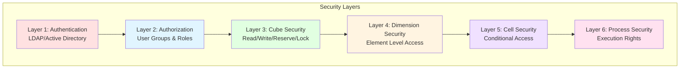

# Bezpečnostní Model - Planning Analytics

## Přehled

Tento dokument definuje kompletní bezpečnostní model pro Planning Analytics aplikaci, včetně rolí, přístupových práv a bezpečnostních politik.

---

## 1. Security Architecture

### 1.1 Security Layers



---

## 2. User Groups & Roles

### 2.1 Group Hierarchy

```
TM1_GROUPS
├── ADMIN
│   └── Full system access
├── FINANCE_CONTROLLER
│   └── Financial oversight
├── PLANNER
│   ├── PLANNER_DIVISION_A
│   ├── PLANNER_DIVISION_B
│   └── PLANNER_DIVISION_C
├── MANAGER
│   ├── MANAGER_DIVISION_A
│   ├── MANAGER_DIVISION_B
│   └── MANAGER_DIVISION_C
└── VIEWER
    └── Read-only access
```

### 2.2 Role Definitions

#### **ADMIN Role**

**Purpose:** Systémová administrace a údržba

**Permissions:**
- Full access to all cubes (READ, WRITE, RESERVE, LOCK)
- Full access to all dimensions
- Execute all processes
- Manage security
- Manage server configuration

**Members:**
- IT Administrators
- TM1 Administrators
- System Architects

**Cube Access:**
```
Sales_PL: ADMIN
Product_Master: ADMIN
Channel_Master: ADMIN
FX_Rates: ADMIN
Assumptions: ADMIN
Allocation_Rules: ADMIN
Data_Quality: ADMIN
}Cubes: ADMIN
}Dimensions: ADMIN
}Processes: ADMIN
}Chores: ADMIN
```

---

#### **FINANCE_CONTROLLER Role**

**Purpose:** Finanční kontroling a oversight

**Permissions:**
- READ access to all versions
- WRITE access to Assumptions cube
- WRITE access to Allocation_Rules
- Execute reporting processes
- View all divisions

**Members:**
- Financial Controllers
- CFO
- Finance Managers

**Cube Access:**
```
Sales_PL: READ
Product_Master: READ
Channel_Master: READ
FX_Rates: WRITE
Assumptions: WRITE
Allocation_Rules: WRITE
Data_Quality: READ
```

**Dimension Security:**
```
Product: ALL elements (READ)
Channel: ALL elements (READ)
Division: ALL elements (READ)
Time: ALL elements (READ)
Version: ALL elements (READ)
Account: ALL elements (READ)
Measure: ALL elements (READ)
Currency: ALL elements (READ)
```

---

#### **PLANNER Role**

**Purpose:** Vytváření a údržba plánů

**Permissions:**
- READ access to Actual version
- WRITE access to Budget, Forecast, Best_Case, Most_Likely, Worst_Case versions
- WRITE access to own division only
- Execute planning processes
- Create personal views

**Members:**
- Financial Planners
- Business Analysts
- Division Controllers

**Cube Access:**
```
Sales_PL: WRITE (with restrictions)
Product_Master: READ
Channel_Master: READ
FX_Rates: READ
Assumptions: READ
Allocation_Rules: READ
Data_Quality: READ
```

**Dimension Security:**
```
Product: ALL elements (READ/WRITE)
Channel: ALL elements (READ/WRITE)
Division: Assigned division only (READ/WRITE)
Time: Future periods only (WRITE), All periods (READ)
Version: Budget/Forecast/Scenarios (WRITE), Actual (READ)
Account: Input accounts only (WRITE), All accounts (READ)
Measure: ALL elements (READ/WRITE)
Currency: ALL elements (READ/WRITE)
```

**Cell Security Rules:**
```tm1
# Planners can only write to their assigned division
['Sales_PL'] = IF(
    ELISANC('Division', !Division, ATTRS('User', USERNAME, 'Assigned_Division')) = 1,
    IF(!Version @<> 'Actual',
        'WRITE',
        'READ'
    ),
    'READ'
);
```

---

#### **MANAGER Role**

**Purpose:** Reporting a analýza

**Permissions:**
- READ access to all versions
- READ access to own division and subordinate divisions
- Execute reports
- Create personal views
- Export to Excel

**Members:**
- Division Managers
- Department Heads
- Senior Management

**Cube Access:**
```
Sales_PL: READ
Product_Master: READ
Channel_Master: READ
FX_Rates: READ
Assumptions: READ
Allocation_Rules: READ
Data_Quality: READ
```

**Dimension Security:**
```
Product: ALL elements (READ)
Channel: ALL elements (READ)
Division: Assigned division + subordinates (READ)
Time: ALL elements (READ)
Version: ALL elements (READ)
Account: ALL elements (READ)
Measure: ALL elements (READ)
Currency: ALL elements (READ)
```

---

#### **VIEWER Role**

**Purpose:** Základní reporting

**Permissions:**
- READ access to selected reports
- READ access to Actual and Budget versions only
- No write access
- No process execution
- Limited dimension access

**Members:**
- General employees
- External auditors (limited)
- Temporary users

**Cube Access:**
```
Sales_PL: READ (limited)
Product_Master: READ
Channel_Master: READ
FX_Rates: NONE
Assumptions: NONE
Allocation_Rules: NONE
Data_Quality: NONE
```

**Dimension Security:**
```
Product: Selected products only (READ)
Channel: Selected channels only (READ)
Division: Selected divisions only (READ)
Time: ALL elements (READ)
Version: Actual, Budget only (READ)
Account: Summary accounts only (READ)
Measure: Amount, Margin_Pct only (READ)
Currency: CZK only (READ)
```

---

## 3. Cube Security Implementation

### 3.1 Sales_PL Cube Security

**Security Cube:** `}CubeSecurity_Sales_PL`

**Dimensions:**
- }Groups
- }Cubes

**Security Matrix:**
```
Group                    | Sales_PL Access
-------------------------|----------------
ADMIN                    | ADMIN
FINANCE_CONTROLLER       | READ
PLANNER                  | WRITE
PLANNER_DIVISION_A       | WRITE
PLANNER_DIVISION_B       | WRITE
PLANNER_DIVISION_C       | WRITE
MANAGER                  | READ
MANAGER_DIVISION_A       | READ
MANAGER_DIVISION_B       | READ
MANAGER_DIVISION_C       | READ
VIEWER                   | READ
```

**Implementation:**
```tm1
# TI Process: Security.Setup.CubeSecurity

# Create security cube if not exists
IF(CubeExists('}CubeSecurity_Sales_PL') = 0);
    CubeCreate('}CubeSecurity_Sales_PL', '}Groups', '}Cubes');
ENDIF;

# Set ADMIN access
CellPutS('ADMIN', '}CubeSecurity_Sales_PL', 'ADMIN', 'Sales_PL');

# Set FINANCE_CONTROLLER access
CellPutS('READ', '}CubeSecurity_Sales_PL', 'FINANCE_CONTROLLER', 'Sales_PL');

# Set PLANNER access
CellPutS('WRITE', '}CubeSecurity_Sales_PL', 'PLANNER', 'Sales_PL');
CellPutS('WRITE', '}CubeSecurity_Sales_PL', 'PLANNER_DIVISION_A', 'Sales_PL');
CellPutS('WRITE', '}CubeSecurity_Sales_PL', 'PLANNER_DIVISION_B', 'Sales_PL');
CellPutS('WRITE', '}CubeSecurity_Sales_PL', 'PLANNER_DIVISION_C', 'Sales_PL');

# Set MANAGER access
CellPutS('READ', '}CubeSecurity_Sales_PL', 'MANAGER', 'Sales_PL');
CellPutS('READ', '}CubeSecurity_Sales_PL', 'MANAGER_DIVISION_A', 'Sales_PL');
CellPutS('READ', '}CubeSecurity_Sales_PL', 'MANAGER_DIVISION_B', 'Sales_PL');
CellPutS('READ', '}CubeSecurity_Sales_PL', 'MANAGER_DIVISION_C', 'Sales_PL');

# Set VIEWER access
CellPutS('READ', '}CubeSecurity_Sales_PL', 'VIEWER', 'Sales_PL');
```

---

### 3.2 Master Data Cubes Security

**Product_Master, Channel_Master:**
```
ADMIN: ADMIN
FINANCE_CONTROLLER: WRITE
PLANNER: READ
MANAGER: READ
VIEWER: READ
```

**Assumptions:**
```
ADMIN: ADMIN
FINANCE_CONTROLLER: WRITE
PLANNER: READ
MANAGER: READ
VIEWER: NONE
```

---

## 4. Dimension Security Implementation

### 4.1 Division Dimension Security

**Security Cube:** `}ElementSecurity_Division`

**Purpose:** Omezit přístup uživatelů pouze k jejich divizím

**Implementation:**
```tm1
# TI Process: Security.Setup.DivisionSecurity

# Create element security cube
IF(CubeExists('}ElementSecurity_Division') = 0);
    CubeCreate('}ElementSecurity_Division', '}Groups', '}ElementAttributes_Division', 'Division');
ENDIF;

# ADMIN - access to all
SubsetCreate('Division', 'All_Divisions');
SubsetElementInsert('Division', 'All_Divisions', 'Total_Company', 1);
vElement = 'Total_Company';
WHILE(vElement @<> '');
    CellPutS('READ', '}ElementSecurity_Division', 'ADMIN', '', vElement);
    vElement = DIMNM('Division', DIMIX('Division', vElement) + 1);
END;

# PLANNER_DIVISION_A - access to Division A only
CellPutS('WRITE', '}ElementSecurity_Division', 'PLANNER_DIVISION_A', '', 'Consumer_Electronics_Division');
CellPutS('WRITE', '}ElementSecurity_Division', 'PLANNER_DIVISION_A', '', 'Mobile_Business_Unit');
CellPutS('WRITE', '}ElementSecurity_Division', 'PLANNER_DIVISION_A', '', 'Computing_Business_Unit');

# Similar for other divisions...
```

---

### 4.2 Version Dimension Security

**Security Cube:** `}ElementSecurity_Version`

**Purpose:** Kontrolovat přístup k různým verzím

**Rules:**
- ADMIN: All versions (WRITE)
- FINANCE_CONTROLLER: All versions (READ), Assumptions (WRITE)
- PLANNER: Actual (READ), Planning versions (WRITE)
- MANAGER: All versions (READ)
- VIEWER: Actual, Budget (READ)

**Implementation:**
```tm1
# Actual version - READ for all except ADMIN
CellPutS('WRITE', '}ElementSecurity_Version', 'ADMIN', '', 'Actual');
CellPutS('READ', '}ElementSecurity_Version', 'FINANCE_CONTROLLER', '', 'Actual');
CellPutS('READ', '}ElementSecurity_Version', 'PLANNER', '', 'Actual');
CellPutS('READ', '}ElementSecurity_Version', 'MANAGER', '', 'Actual');
CellPutS('READ', '}ElementSecurity_Version', 'VIEWER', '', 'Actual');

# Budget version - WRITE for PLANNER
CellPutS('WRITE', '}ElementSecurity_Version', 'ADMIN', '', 'Budget');
CellPutS('READ', '}ElementSecurity_Version', 'FINANCE_CONTROLLER', '', 'Budget');
CellPutS('WRITE', '}ElementSecurity_Version', 'PLANNER', '', 'Budget');
CellPutS('READ', '}ElementSecurity_Version', 'MANAGER', '', 'Budget');
CellPutS('READ', '}ElementSecurity_Version', 'VIEWER', '', 'Budget');

# Forecast and Scenarios - WRITE for PLANNER, READ for others
# Similar pattern...
```

---

### 4.3 Account Dimension Security

**Security Cube:** `}ElementSecurity_Account`

**Purpose:** Omezit přístup k citlivým účtům

**Rules:**
- Input accounts: WRITE for PLANNER
- Calculated accounts: READ only
- Sensitive accounts: ADMIN and FINANCE_CONTROLLER only

**Implementation:**
```tm1
# Input accounts - WRITE for PLANNER
vAccount = 'Salaries';
WHILE(ATTRS('Account', vAccount, 'Calculation_Type') @= 'Input');
    CellPutS('WRITE', '}ElementSecurity_Account', 'PLANNER', '', vAccount);
    # Next account...
END;

# Calculated accounts - READ only
vAccount = 'Revenue';
WHILE(ATTRS('Account', vAccount, 'Calculation_Type') @= 'Calculated');
    CellPutS('READ', '}ElementSecurity_Account', 'PLANNER', '', vAccount);
    # Next account...
END;
```

---

## 5. Cell-Level Security

### 5.1 Dynamic Cell Security Rules

**Purpose:** Implementovat komplexní business pravidla pro přístup k buňkám

**Example 1: Division-based Access**
```tm1
# File: }CellSecurity_Sales_PL.rux

# Planners can only write to their assigned division
[] = S:
    IF(
        # Check if user is in PLANNER group
        CELLGETS('}ClientGroups', USERNAME, 'PLANNER') @= 'PLANNER',
        
        # Check if division matches user's assigned division
        IF(
            !Division @= ATTRS('User', USERNAME, 'Assigned_Division'),
            
            # Check if version is editable
            IF(
                !Version @<> 'Actual',
                'WRITE',
                'READ'
            ),
            'READ'
        ),
        CONTINUE
    );
```

**Example 2: Time-based Access**
```tm1
# Planners can only edit future periods
[] = S:
    IF(
        CELLGETS('}ClientGroups', USERNAME, 'PLANNER') @= 'PLANNER',
        
        # Check if period is in the future
        IF(
            ATTRS('Time', !Time, 'Period_End_Date') > TODAY,
            'WRITE',
            'READ'
        ),
        CONTINUE
    );
```

**Example 3: Version-based Access**
```tm1
# Actual version is read-only for all except ADMIN
[] = S:
    IF(
        !Version @= 'Actual',
        IF(
            CELLGETS('}ClientGroups', USERNAME, 'ADMIN') @= 'ADMIN',
            'WRITE',
            'READ'
        ),
        CONTINUE
    );
```

---

## 6. Process Security

### 6.1 Process Groups

**Security Cube:** `}ProcessSecurity`

**Categories:**
1. **Admin Processes** - ADMIN only
2. **Import Processes** - ADMIN, FINANCE_CONTROLLER
3. **Planning Processes** - ADMIN, PLANNER
4. **Reporting Processes** - All users
5. **Maintenance Processes** - ADMIN only

**Implementation:**
```tm1
# TI Process: Security.Setup.ProcessSecurity

# Admin processes
CellPutS('ADMIN', '}ProcessSecurity', 'ADMIN', 'Dim.Time.Create');
CellPutS('ADMIN', '}ProcessSecurity', 'ADMIN', 'Maint.ZeroOut.Cube');
CellPutS('ADMIN', '}ProcessSecurity', 'ADMIN', 'Maint.Archive.OldData');

# Import processes
CellPutS('ADMIN', '}ProcessSecurity', 'ADMIN', 'Import.Sales.Actual');
CellPutS('WRITE', '}ProcessSecurity', 'FINANCE_CONTROLLER', 'Import.Sales.Actual');

# Planning processes
CellPutS('ADMIN', '}ProcessSecurity', 'ADMIN', 'Transform.CopyVersion');
CellPutS('WRITE', '}ProcessSecurity', 'PLANNER', 'Transform.CopyVersion');
CellPutS('WRITE', '}ProcessSecurity', 'PLANNER', 'Transform.ApplyGrowth');

# Reporting processes
CellPutS('READ', '}ProcessSecurity', 'MANAGER', 'Report.PL.Generate');
CellPutS('READ', '}ProcessSecurity', 'VIEWER', 'Report.PL.Generate');
```

---

## 7. Chore Security

### 7.1 Scheduled Chores

**Security Cube:** `}ChoreSecurity`

**Chores:**
1. **Daily_Import** - ADMIN only
2. **Weekly_Maintenance** - ADMIN only
3. **Monthly_Reporting** - ADMIN, FINANCE_CONTROLLER

**Implementation:**
```tm1
# Only ADMIN can execute chores
CellPutS('ADMIN', '}ChoreSecurity', 'ADMIN', 'Daily_Import');
CellPutS('ADMIN', '}ChoreSecurity', 'ADMIN', 'Weekly_Maintenance');
CellPutS('ADMIN', '}ChoreSecurity', 'ADMIN', 'Monthly_Reporting');
```

---

## 8. User Attributes

### 8.1 User Dimension Attributes

**Purpose:** Uložit dodatečné informace o uživatelích

**Attributes:**
- User_Email (String)
- User_Department (String)
- Assigned_Division (String)
- User_Role (String)
- Active_Flag (String)
- Last_Login (String)

**Implementation:**
```tm1
# TI Process: Security.Setup.UserAttributes

# Create attributes
AttrInsert('User', '', 'User_Email', 'S');
AttrInsert('User', '', 'User_Department', 'S');
AttrInsert('User', '', 'Assigned_Division', 'S');
AttrInsert('User', '', 'User_Role', 'S');
AttrInsert('User', '', 'Active_Flag', 'S');
AttrInsert('User', '', 'Last_Login', 'S');

# Set attributes for users
AttrPutS('john.doe@company.com', 'User', 'john.doe', 'User_Email');
AttrPutS('Finance', 'User', 'john.doe', 'User_Department');
AttrPutS('Consumer_Electronics_Division', 'User', 'john.doe', 'Assigned_Division');
AttrPutS('PLANNER', 'User', 'john.doe', 'User_Role');
AttrPutS('Y', 'User', 'john.doe', 'Active_Flag');
```

---

## 9. Audit & Logging

### 9.1 Audit Cube

**Cube:** `Audit_Log`

**Dimensions:**
- User
- Action_Type (Login, Logout, Data_Change, Process_Execute)
- Cube_Name
- Time
- Details

**Purpose:** Sledovat všechny uživatelské aktivity

**Implementation:**
```tm1
# In Rules: Log data changes
[] = N:
    # Log the change
    CELLPUTN(1, 'Audit_Log', USERNAME, 'Data_Change', 
             'Sales_PL', TIMST(NOW, '\Y-\m-\d \h:\i:\s', 1), 
             'Changed: ' | !Account | ' for ' | !Division);
    
    # Continue with normal calculation
    CONTINUE;
```

### 9.2 Login Tracking

**TI Process:** `Security.Track.Login`

**Trigger:** On user login

```tm1
# Update last login time
AttrPutS(TIMST(NOW, '\Y-\m-\d \h:\i:\s', 1), 'User', USERNAME, 'Last_Login');

# Log login event
CellPutN(1, 'Audit_Log', USERNAME, 'Login', '', 
         TIMST(NOW, '\Y-\m-\d \h:\i:\s', 1), 'User logged in');
```

---

## 10. Security Best Practices

### 10.1 Password Policy

**Requirements:**
- Minimum 12 characters
- Mix of uppercase, lowercase, numbers, special characters
- Password expiry: 90 days
- Password history: 5 passwords
- Account lockout: 5 failed attempts

**Implementation:** Via Active Directory/LDAP

### 10.2 Session Management

**Settings:**
- Session timeout: 30 minutes of inactivity
- Maximum concurrent sessions: 3 per user
- Force logout on password change

### 10.3 Data Encryption

**At Rest:**
- Database encryption enabled
- Backup encryption enabled
- File system encryption (BitLocker/LUKS)

**In Transit:**
- SSL/TLS for all connections
- HTTPS for web interfaces
- Encrypted ODBC connections

### 10.4 Regular Security Reviews

**Monthly:**
- Review user access rights
- Review failed login attempts
- Review audit logs

**Quarterly:**
- Full security audit
- User access recertification
- Security policy review

**Annually:**
- Penetration testing
- Security training refresh
- Disaster recovery drill

---

## 11. Security Maintenance Procedures

### 11.1 User Onboarding

**Process:**
1. Create user account in AD/LDAP
2. Assign to appropriate TM1 group
3. Set user attributes
4. Assign division access
5. Provide training
6. Document in user registry

**TI Process:** `Security.User.Create`

### 11.2 User Offboarding

**Process:**
1. Disable user account
2. Remove from all TM1 groups
3. Archive user's work
4. Update audit log
5. Document in user registry

**TI Process:** `Security.User.Disable`

### 11.3 Access Review

**Process:**
1. Generate access report
2. Review with managers
3. Remove unnecessary access
4. Document changes
5. Notify affected users

**TI Process:** `Security.Access.Review`

---

## 12. Emergency Procedures

### 12.1 Security Breach Response

**Steps:**
1. Identify breach scope
2. Disable affected accounts
3. Change admin passwords
4. Review audit logs
5. Notify stakeholders
6. Implement fixes
7. Document incident
8. Post-mortem review

### 12.2 Lost Admin Access

**Recovery:**
1. Use emergency admin account
2. Reset admin password
3. Review security logs
4. Restore access
5. Document incident

---

## 13. Compliance Requirements

### 13.1 SOX Compliance

**Requirements:**
- Segregation of duties
- Audit trail of all changes
- Regular access reviews
- Change management process

**Implementation:**
- Separate PLANNER and CONTROLLER roles
- Audit_Log cube
- Quarterly access reviews
- Documented change process

### 13.2 GDPR Compliance

**Requirements:**
- Data minimization
- Right to access
- Right to erasure
- Data portability

**Implementation:**
- Store only necessary user data
- Provide user data export
- User deletion process
- Data retention policy

---

## 14. Security Testing

### 14.1 Test Scenarios

**Test 1: Role-based Access**
- Verify PLANNER can write to Budget
- Verify PLANNER cannot write to Actual
- Verify VIEWER can only read

**Test 2: Division Security**
- Verify PLANNER_DIVISION_A can only access Division A
- Verify cross-division access is blocked

**Test 3: Time-based Security**
- Verify historical periods are read-only
- Verify future periods are editable

**Test 4: Process Security**
- Verify only ADMIN can execute admin processes
- Verify PLANNER can execute planning processes

### 14.2 Security Checklist

- [ ] All users assigned to appropriate groups
- [ ] Cube security configured for all cubes
- [ ] Dimension security configured where needed
- [ ] Cell security rules implemented
- [ ] Process security configured
- [ ] Audit logging enabled
- [ ] Password policy enforced
- [ ] Session timeout configured
- [ ] Encryption enabled
- [ ] Regular backups configured
- [ ] Security documentation complete
- [ ] User training completed
- [ ] Security testing passed
- [ ] Compliance requirements met

---

## Závěr

Tento bezpečnostní model poskytuje robustní, vícevrstvou ochranu dat a funkcí v Planning Analytics aplikaci. Model je navržen tak, aby byl flexibilní, auditovatelný a v souladu s regulatorními požadavky.

**Klíčové Principy:**
- Least privilege access
- Segregation of duties
- Defense in depth
- Audit everything
- Regular reviews
- Compliance first