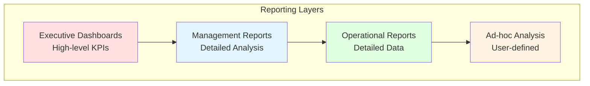

# Reporty a Dashboardy - Planning Analytics

## Přehled

Tento dokument definuje všechny reporty, dashboardy a analytické pohledy pro Planning Analytics aplikaci.

---

## 1. Reporting Architecture

### 1.1 Reporting Layers



---

## 2. Executive Dashboards

### 2.1 Dashboard: Executive P&L Overview

**Účel:** Přehled finanční výkonnosti pro top management

**Cílová skupina:** CEO, CFO, Board Members

**Aktualizace:** Real-time

**Komponenty:**

#### KPI Cards
```
┌─────────────────┬─────────────────┬─────────────────┬─────────────────┐
│   Revenue       │   Gross Margin  │   EBITDA        │   Net Income    │
│   125.5M CZK    │   45.2M CZK     │   28.3M CZK     │   22.1M CZK     │
│   ↑ 12.5%       │   ↑ 8.3%        │   ↑ 15.2%       │   ↑ 18.5%       │
└─────────────────┴─────────────────┴─────────────────┴─────────────────┘
```

#### Revenue Trend Chart
- Line chart: Actual vs Budget vs Forecast
- Time period: Last 12 months + Next 6 months
- Drill-down: By Division, Channel, Product Category

#### Margin Analysis
- Waterfall chart: Revenue → COGS → Gross Margin → OPEX → EBITDA
- Comparison: Current Year vs Prior Year
- Drill-down: By Account

#### Division Performance
- Bar chart: Revenue and EBITDA by Division
- Color coding: Green (above target), Yellow (on target), Red (below target)
- Drill-down: Division details

#### Scenario Comparison
- Table: Best Case vs Most Likely vs Worst Case
- Metrics: Revenue, EBITDA, Net Income
- Variance analysis

**View Definition:**
```
Cube: Sales_PL
Rows: Account (Revenue, Gross_Margin, EBITDA, Net_Income)
Columns: Time (Last 12 months)
Context:
  - Division: Total_Company
  - Channel: Total_Channels
  - Product: Total_Products
  - Version: Actual, Budget, Forecast
  - Measure: Amount
  - Currency: CZK
```

---

### 2.2 Dashboard: Sales Performance

**Účel:** Sledování prodejní výkonnosti

**Cílová skupina:** Sales Directors, Management

**Aktualizace:** Daily

**Komponenty:**

#### Sales by Channel
- Pie chart: Revenue distribution by channel
- Metrics: Revenue, Volume, Average Price
- Drill-down: Channel details

#### Product Mix
- Stacked bar chart: Revenue by Product Category
- Time comparison: MTD, QTD, YTD
- Drill-down: Product details

#### Top Products
- Table: Top 10 products by revenue
- Columns: Product, Revenue, Volume, Growth %
- Sorting: By revenue descending

#### Channel Efficiency
- Scatter plot: Volume vs Margin % by Channel
- Bubble size: Revenue
- Quadrant analysis

**View Definition:**
```
Cube: Sales_PL
Rows: Product (Top level categories)
Columns: Channel, Time (Current Month)
Context:
  - Division: Total_Company
  - Version: Actual
  - Account: Product_Revenue
  - Measure: Amount, Quantity, Margin_Pct
  - Currency: CZK
```

---

### 2.3 Dashboard: Financial Planning

**Účel:** Monitoring plánovacího procesu

**Cílová skupina:** Financial Controllers, Planners

**Aktualizace:** Real-time

**Komponenty:**

#### Planning Status
- Progress bars: Completion % by Division
- Status indicators: Not Started, In Progress, Completed, Approved
- Drill-down: Division planning details

#### Variance Analysis
- Heatmap: Actual vs Budget variance by Division and Account
- Color coding: Red (unfavorable), Green (favorable)
- Threshold: ±5%

#### Forecast Accuracy
- Line chart: Forecast vs Actual over time
- Metrics: MAPE (Mean Absolute Percentage Error)
- Drill-down: By Division, Product

#### Assumptions Tracking
- Table: Key assumptions and their values
- Columns: Assumption, Current Value, Prior Value, Change %
- Alerts: Significant changes

**View Definition:**
```
Cube: Sales_PL
Rows: Division, Account
Columns: Version (Actual, Budget, Forecast), Time
Context:
  - Product: Total_Products
  - Channel: Total_Channels
  - Measure: Amount
  - Currency: CZK
```

---

## 3. Management Reports

### 3.1 Report: Detailed P&L Statement

**Účel:** Kompletní P&L výkaz s drill-down možnostmi

**Cílová skupina:** Management, Controllers

**Formát:** Excel, PDF

**Frekvence:** Monthly

**Struktura:**

```
PROFIT & LOSS STATEMENT
Period: [Month Year]
Version: [Actual / Budget / Forecast]
Division: [Selected Division]

                                    Current Month    YTD         Budget      Variance    Variance %
                                    -------------    --------    --------    --------    ----------
REVENUE
  Product Revenue                   10,500,000       95,200,000  92,000,000  3,200,000   3.5%
  Other Revenue                        250,000        2,100,000   2,000,000    100,000   5.0%
  Revenue Adjustments                 (150,000)      (1,300,000) (1,200,000)  (100,000)  8.3%
    Returns                            (80,000)        (700,000)   (650,000)   (50,000)  7.7%
    Discounts                          (70,000)        (600,000)   (550,000)   (50,000)  9.1%
                                    -------------    --------    --------    --------    ----------
TOTAL REVENUE                        10,600,000       96,000,000  92,800,000  3,200,000   3.4%

COST OF GOODS SOLD
  Product COGS                        6,300,000       57,120,000  55,680,000  1,440,000   2.6%
  Freight Costs                         180,000        1,620,000   1,560,000     60,000   3.8%
  Warehousing Costs                     120,000        1,080,000   1,040,000     40,000   3.8%
                                    -------------    --------    --------    --------    ----------
TOTAL COGS                            6,600,000       59,820,000  58,280,000  1,540,000   2.6%

GROSS MARGIN                          4,000,000       36,180,000  34,520,000  1,660,000   4.8%
Gross Margin %                           37.7%           37.7%       37.2%        0.5%

OPERATING EXPENSES
  Personnel Costs                     1,800,000       16,200,000  15,600,000    600,000   3.8%
    Salaries                          1,400,000       12,600,000  12,000,000    600,000   5.0%
    Benefits                            300,000        2,700,000   2,700,000          0   0.0%
    Training                            100,000          900,000     900,000          0   0.0%
  
  Facility Costs                        450,000        4,050,000   3,900,000    150,000   3.8%
    Rent                                300,000        2,700,000   2,700,000          0   0.0%
    Utilities                           100,000          900,000     840,000     60,000   7.1%
    Maintenance                          50,000          450,000     360,000     90,000  25.0%
  
  Marketing Costs                       600,000        5,400,000   5,100,000    300,000   5.9%
    Advertising                         350,000        3,150,000   3,000,000    150,000   5.0%
    Promotions                          150,000        1,350,000   1,200,000    150,000  12.5%
    Digital Marketing                   100,000          900,000     900,000          0   0.0%
  
  IT Costs                              250,000        2,250,000   2,160,000     90,000   4.2%
  Other OPEX                            200,000        1,800,000   1,740,000     60,000   3.4%
                                    -------------    --------    --------    --------    ----------
TOTAL OPERATING EXPENSES              3,300,000       29,700,000  28,500,000  1,200,000   4.2%

EBITDA                                  700,000        6,480,000   6,020,000    460,000   7.6%
EBITDA Margin %                           6.6%            6.7%        6.5%        0.2%

Depreciation                            150,000        1,350,000   1,320,000     30,000   2.3%

EBIT                                    550,000        5,130,000   4,700,000    430,000   9.1%
EBIT Margin %                             5.2%            5.3%        5.1%        0.2%

CAPEX (Information Only)
  IT Infrastructure                     200,000        1,200,000   1,500,000   (300,000) -20.0%
  Store Equipment                       150,000          900,000   1,000,000   (100,000) -10.0%
  Warehouse Equipment                   100,000          600,000     800,000   (200,000) -25.0%
  Other CAPEX                            50,000          300,000     400,000   (100,000) -25.0%
                                    -------------    --------    --------    --------    ----------
TOTAL CAPEX                             500,000        3,000,000   3,700,000   (700,000) -18.9%
```

**View Definition:**
```
Cube: Sales_PL
Rows: Account (Full hierarchy)
Columns: Time (Current Month, YTD), Version (Actual, Budget)
Context:
  - Division: User-selected
  - Channel: Total_Channels
  - Product: Total_Products
  - Measure: Amount
  - Currency: CZK
```

---

### 3.2 Report: Division Performance Analysis

**Účel:** Porovnání výkonnosti divizí

**Cílová skupina:** Management, Division Heads

**Formát:** Excel, PDF

**Frekvence:** Monthly

**Struktura:**

```
DIVISION PERFORMANCE ANALYSIS
Period: [Month Year]

Division Summary:
┌──────────────────────────┬──────────┬──────────┬──────────┬──────────┬──────────┐
│ Division                 │ Revenue  │ COGS     │ Gross    │ OPEX     │ EBITDA   │
│                          │          │          │ Margin   │          │          │
├──────────────────────────┼──────────┼──────────┼──────────┼──────────┼──────────┤
│ Consumer Electronics     │ 45.2M    │ 27.1M    │ 18.1M    │ 12.5M    │ 5.6M     │
│   % of Total             │   42.6%  │   45.3%  │   50.0%  │   42.1%  │   86.2%  │
│   Margin %               │          │          │   40.0%  │          │   12.4%  │
├──────────────────────────┼──────────┼──────────┼──────────┼──────────┼──────────┤
│ Enterprise Solutions     │ 38.5M    │ 23.1M    │ 15.4M    │ 11.2M    │ 4.2M     │
│   % of Total             │   36.3%  │   38.6%  │   42.5%  │   37.7%  │   64.6%  │
│   Margin %               │          │          │   40.0%  │          │   10.9%  │
├──────────────────────────┼──────────┼──────────┼──────────┼──────────┼──────────┤
│ E-commerce               │ 22.3M    │  9.6M    │ 12.7M    │  6.0M    │ 6.7M     │
│   % of Total             │   21.1%  │   16.1%  │   35.1%  │   20.2%  │  103.1%  │
│   Margin %               │          │          │   56.9%  │          │   30.0%  │
├──────────────────────────┼──────────┼──────────┼──────────┼──────────┼──────────┤
│ TOTAL COMPANY            │ 106.0M   │ 59.8M    │ 46.2M    │ 29.7M    │ 16.5M    │
│   Margin %               │          │          │   43.6%  │          │   15.6%  │
└──────────────────────────┴──────────┴──────────┴──────────┴──────────┴──────────┘

Year-over-Year Growth:
┌──────────────────────────┬──────────┬──────────┬──────────┬──────────┐
│ Division                 │ Revenue  │ Gross    │ EBITDA   │ EBITDA   │
│                          │ Growth   │ Margin   │ Growth   │ Margin   │
│                          │          │ Growth   │          │ Change   │
├──────────────────────────┼──────────┼──────────┼──────────┼──────────┤
│ Consumer Electronics     │  +12.5%  │  +15.2%  │  +18.5%  │  +0.6pp  │
│ Enterprise Solutions     │   +8.3%  │  +10.1%  │  +12.3%  │  +0.4pp  │
│ E-commerce               │  +25.7%  │  +28.3%  │  +32.1%  │  +1.5pp  │
│ TOTAL COMPANY            │  +14.2%  │  +16.8%  │  +19.5%  │  +0.7pp  │
└──────────────────────────┴──────────┴──────────┴──────────┴──────────┘
```

**View Definition:**
```
Cube: Sales_PL
Rows: Division (Level 1), Account (Selected accounts)
Columns: Time (Current Month, Prior Year Month)
Context:
  - Channel: Total_Channels
  - Product: Total_Products
  - Version: Actual
  - Measure: Amount
  - Currency: CZK
```

---

### 3.3 Report: Product Performance Analysis

**Účel:** Analýza výkonnosti produktů

**Cílová skupina:** Product Managers, Sales

**Formát:** Excel

**Frekvence:** Monthly

**Struktura:**

```
PRODUCT PERFORMANCE ANALYSIS
Period: [Month Year]

Top 20 Products by Revenue:
┌────┬─────────────────┬──────────┬──────────┬──────────┬──────────┬──────────┬──────────┐
│ #  │ Product         │ Revenue  │ Volume   │ Avg      │ Margin   │ Margin   │ Growth   │
│    │                 │          │ (Units)  │ Price    │ Amount   │ %        │ YoY      │
├────┼─────────────────┼──────────┼──────────┼──────────┼──────────┼──────────┼──────────┤
│ 1  │ iPhone 15 Pro   │ 12.5M    │  5,000   │ 2,500    │ 5.0M     │  40.0%   │  +15.2%  │
│ 2  │ MacBook Pro M3  │ 10.2M    │  2,000   │ 5,100    │ 4.1M     │  40.2%   │  +12.8%  │
│ 3  │ iPad Pro        │  8.7M    │  4,500   │ 1,933    │ 3.5M     │  40.2%   │  +18.5%  │
│ 4  │ Samsung S24     │  7.3M    │  3,800   │ 1,921    │ 2.9M     │  39.7%   │  +10.3%  │
│ 5  │ Dell XPS 15     │  6.8M    │  1,800   │ 3,778    │ 2.7M     │  39.7%   │   +8.5%  │
│... │ ...             │  ...     │  ...     │  ...     │  ...     │  ...     │  ...     │
└────┴─────────────────┴──────────┴──────────┴──────────┴──────────┴──────────┴──────────┘

Product Category Analysis:
┌─────────────────┬──────────┬──────────┬──────────┬──────────┬──────────┐
│ Category        │ Revenue  │ % of     │ Volume   │ Avg      │ Margin   │
│                 │          │ Total    │ (Units)  │ Price    │ %        │
├─────────────────┼──────────┼──────────┼──────────┼──────────┼──────────┤
│ Mobile Phones   │ 35.2M    │  33.2%   │ 18,500   │ 1,903    │  39.8%   │
│ Computers       │ 28.7M    │  27.1%   │  8,200   │ 3,500    │  40.1%   │
│ Tablets         │ 18.5M    │  17.5%   │ 10,500   │ 1,762    │  40.3%   │
│ Notebooks       │ 15.3M    │  14.4%   │  4,800   │ 3,188    │  39.9%   │
│ Accessories     │  8.3M    │   7.8%   │ 45,000   │   184    │  45.2%   │
├─────────────────┼──────────┼──────────┼──────────┼──────────┼──────────┤
│ TOTAL           │ 106.0M   │ 100.0%   │ 87,000   │ 1,218    │  40.5%   │
└─────────────────┴──────────┴──────────┴──────────┴──────────┴──────────┘
```

**View Definition:**
```
Cube: Sales_PL
Rows: Product (Leaf level)
Columns: Time (Current Month), Measure (Amount, Quantity, Price, Margin_Pct)
Context:
  - Division: Total_Company
  - Channel: Total_Channels
  - Version: Actual
  - Account: Product_Revenue, Gross_Margin
  - Currency: CZK
Sorting: By Revenue descending
Top N: 20
```

---

### 3.4 Report: Channel Performance Analysis

**Účel:** Analýza výkonnosti prodejních kanálů

**Cílová skupina:** Sales Directors, Channel Managers

**Formát:** Excel, PDF

**Frekvence:** Monthly

**Struktura:**

```
CHANNEL PERFORMANCE ANALYSIS
Period: [Month Year]

Channel Summary:
┌─────────────────┬──────────┬──────────┬──────────┬──────────┬──────────┐
│ Channel         │ Revenue  │ % of     │ Volume   │ Avg      │ Margin   │
│                 │          │ Total    │ (Units)  │ Price    │ %        │
├─────────────────┼──────────┼──────────┼──────────┼──────────┼──────────┤
│ Direct Sales    │ 42.4M    │  40.0%   │ 35,000   │ 1,211    │  42.5%   │
│   Flagship      │ 18.5M    │  17.5%   │ 12,000   │ 1,542    │  43.2%   │
│   Standard      │ 20.2M    │  19.0%   │ 19,000   │ 1,063    │  42.1%   │
│   Pop-up        │  3.7M    │   3.5%   │  4,000   │   925    │  41.8%   │
├─────────────────┼──────────┼──────────┼──────────┼──────────┼──────────┤
│ Partner Sales   │ 38.3M    │  36.1%   │ 32,000   │ 1,197    │  38.5%   │
│   Authorized    │ 22.1M    │  20.8%   │ 18,000   │ 1,228    │  39.2%   │
│   Retail Chains │ 12.8M    │  12.1%   │ 11,000   │ 1,164    │  37.8%   │
│   Wholesale     │  3.4M    │   3.2%   │  3,000   │ 1,133    │  36.5%   │
├─────────────────┼──────────┼──────────┼──────────┼──────────┼──────────┤
│ Online Sales    │ 25.3M    │  23.9%   │ 20,000   │ 1,265    │  45.2%   │
│   Website       │ 15.2M    │  14.3%   │ 12,000   │ 1,267    │  45.5%   │
│   Marketplace   │  8.5M    │   8.0%   │  6,500   │ 1,308    │  44.8%   │
│   Mobile App    │  1.6M    │   1.5%   │  1,500   │ 1,067    │  45.0%   │
├─────────────────┼──────────┼──────────┼──────────┼──────────┼──────────┤
│ TOTAL           │ 106.0M   │ 100.0%   │ 87,000   │ 1,218    │  41.5%   │
└─────────────────┴──────────┴──────────┴──────────┴──────────┴──────────┘

Channel Efficiency Metrics:
┌─────────────────┬──────────┬──────────┬──────────┬──────────┐
│ Channel         │ Cost per │ Conv.    │ Customer │ Repeat   │
│                 │ Trans.   │ Rate     │ Acq Cost │ Rate     │
├─────────────────┼──────────┼──────────┼──────────┼──────────┤
│ Direct Sales    │   125    │  18.5%   │   850    │  45.2%   │
│ Partner Sales   │    85    │  12.3%   │   650    │  38.5%   │
│ Online Sales    │    45    │  25.7%   │   320    │  52.8%   │
└─────────────────┴──────────┴──────────┴──────────┴──────────┘
```

---

## 4. Operational Reports

### 4.1 Report: Monthly Data Input Status

**Účel:** Sledování stavu zadávání dat

**Cílová skupina:** Controllers, Planners

**Formát:** Excel

**Frekvence:** Daily during planning cycle

---

### 4.2 Report: Variance Analysis Detail

**Účel:** Detailní analýza odchylek

**Cílová skupina:** Controllers, Management

**Formát:** Excel

**Frekvence:** Monthly

---

### 4.3 Report: Forecast Accuracy

**Účel:** Měření přesnosti forecastu

**Cílová skupina:** Controllers, Planners

**Formát:** Excel

**Frekvence:** Monthly

---

## 5. Ad-hoc Analysis Views

### 5.1 View: Planning Input Form

**Účel:** Zadávání plánovacích dat

**Cílová skupina:** Planners

**Layout:**
```
Rows: Product (User's products)
Columns: Time (Next 12 months), Measure (Quantity, Price, Cost)
Context:
  - Division: User's division
  - Channel: User-selectable
  - Version: Budget/Forecast
  - Account: Product_Revenue, Product_COGS
  - Currency: CZK
```

**Features:**
- Editable cells highlighted
- Validation rules applied
- Copy/paste from Excel
- Spread functions
- Growth rate application

---

### 5.2 View: Scenario Comparison

**Účel:** Porovnání různých scénářů

**Cílová skupina:** Controllers, Management

**Layout:**
```
Rows: Account (P&L hierarchy)
Columns: Version (Actual, Budget, Best_Case, Most_Likely, Worst_Case)
Context:
  - Division: User-selectable
  - Channel: Total_Channels
  - Product: Total_Products
  - Time: User-selectable
  - Measure: Amount
  - Currency: CZK
```

---

### 5.3 View: Drill-down Analysis

**Účel:** Detailní analýza s drill-down

**Cílová skupina:** All users

**Layout:**
```
Rows: User-selectable dimension
Columns: User-selectable dimension
Context: User-selectable
```

**Features:**
- Dynamic dimension selection
- Drill-down/up capability
- Export to Excel
- Save personal views

---

## 6. Report Scheduling

### 6.1 Automated Report Distribution

**Daily Reports (7:00 AM):**
- Executive Dashboard (PDF) → CEO, CFO
- Sales Performance (Excel) → Sales Directors

**Weekly Reports (Monday 8:00 AM):**
- Division Performance (Excel) → Division Heads
- Channel Performance (Excel) → Channel Managers

**Monthly Reports (1st day 9:00 AM):**
- Detailed P&L (Excel + PDF) → Management, Controllers
- Product Performance (Excel) → Product Managers
- Variance Analysis (Excel) → Controllers
- Forecast Accuracy (Excel) → Controllers

---

## 7. Report Templates

### 7.1 Excel Template Structure

**Workbook Tabs:**
1. **Summary** - Executive summary
2. **P&L** - Detailed P&L statement
3. **Variance** - Variance analysis
4. **Trends** - Trend charts
5. **Details** - Supporting details
6. **Assumptions** - Key assumptions
7. **Notes** - Commentary

**Standard Features:**
- Company logo and branding
- Report metadata (date, version, user)
- Dynamic titles
- Conditional formatting
- Charts and visualizations
- Print-ready layout

---

## 8. Dashboard Design Guidelines

### 8.1 Visual Design Principles

**Color Scheme:**
- Primary: Blue (#0066CC)
- Success: Green (#00AA00)
- Warning: Yellow (#FFAA00)
- Error: Red (#CC0000)
- Neutral: Gray (#666666)

**Typography:**
- Headers: Arial Bold, 14-18pt
- Body: Arial Regular, 10-12pt
- Numbers: Arial, right-aligned

**Layout:**
- Grid-based layout
- Consistent spacing
- Clear hierarchy
- White space utilization

### 8.2 KPI Display Standards

**Format:**
```
┌─────────────────────┐
│ KPI Name            │
│ 125.5M CZK          │ ← Large, bold
│ ↑ 12.5% vs Budget   │ ← Smaller, with icon
│ ▓▓▓▓▓▓▓░░░ 75%      │ ← Progress bar
└─────────────────────┘
```

**Icons:**
- ↑ Positive trend (green)
- ↓ Negative trend (red)
- → Flat trend (gray)
- ⚠ Warning (yellow)
- ✓ Target met (green)
- ✗ Target missed (red)

---

## 9. Mobile Reporting

### 9.1 Mobile Dashboard

**Purpose:** Executive KPIs on mobile devices

**Features:**
- Responsive design
- Touch-optimized
- Offline capability
- Push notifications

**Content:**
- Key KPIs
- Trend charts
- Alerts
- Quick filters

---

## 10. Report Performance Optimization

### 10.1 Best Practices

**View Optimization:**
- Use subsets to limit data
- Apply zero suppression
- Use aliases for display
- Cache frequently used views

**Query Optimization:**
- Minimize MDX complexity
- Use server-side calculations
- Implement view caching
- Schedule heavy reports off-peak

**Export Optimization:**
- Limit export size
- Use incremental exports
- Compress large files
- Schedule bulk exports

---

## 11. Report Testing Checklist

### 11.1 Functional Testing

- [ ] Data accuracy verified
- [ ] Calculations correct
- [ ] Drill-down working
- [ ] Filters functioning
- [ ] Export working
- [ ] Formatting correct
- [ ] Charts displaying
- [ ] Security applied

### 11.2 Performance Testing

- [ ] Load time < 5 seconds
- [ ] Export time < 30 seconds
- [ ] Concurrent users tested
- [ ] Large data sets tested

### 11.3 User Acceptance Testing

- [ ] Business users trained
- [ ] Feedback collected
- [ ] Issues resolved
- [ ] Sign-off obtained

---

## 12. Report Documentation

### 12.1 Report Catalog

**For each report document:**
- Report name and ID
- Purpose and audience
- Data sources
- Update frequency
- Distribution list
- Access requirements
- Technical specifications
- Change history

### 12.2 User Guides

**Content:**
- How to access reports
- How to interpret data
- How to use filters
- How to drill-down
- How to export
- Troubleshooting
- FAQ

---

## Závěr

Tento reporting framework poskytuje kompletní sadu reportů a dashboardů pro všechny úrovně organizace, od executive management po operativní uživatele.

**Klíčové Vlastnosti:**
- Multi-level reporting
- Real-time dashboards
- Automated distribution
- Mobile access
- Self-service analytics
- Performance optimized
- User-friendly design