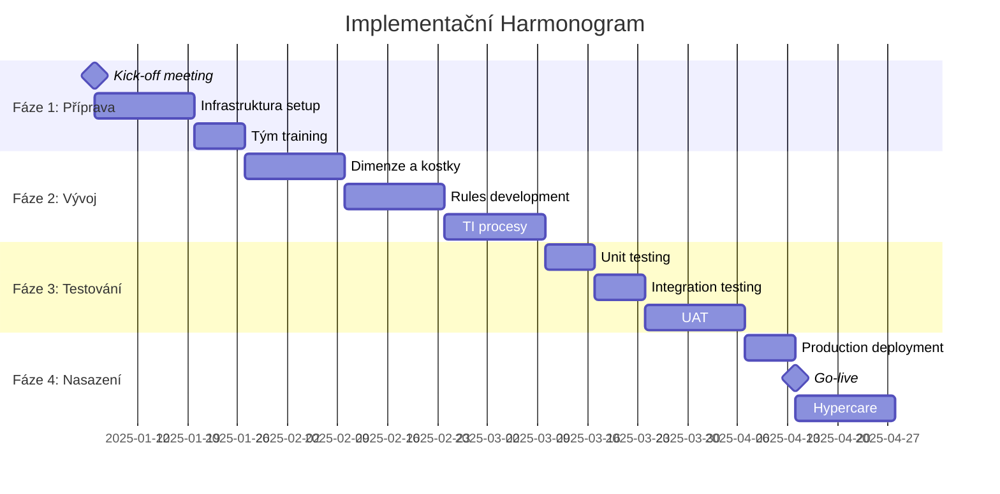

# Implementační Plán - Planning Analytics Aplikace

## Přehled

Tento dokument definuje kompletní implementační plán pro nasazení Planning Analytics aplikace pro finanční plánování a forecast.

---

## 1. Executive Summary

### 1.1 Projekt Overview

**Název projektu:** Planning Analytics - Finanční Plánování Elektronika  
**Doba trvání:** 16 týdnů (4 měsíce)  
**Rozpočet:** Dle dohody  
**Tým:** 5-7 osob  
**Go-live datum:** Cílový termín dle harmonogramu

### 1.2 Klíčové Milníky



---

## 2. Projektová Struktura

### 2.1 Projektový Tým

#### Core Team

**Project Manager**
- Celková koordinace projektu
- Řízení harmonogramu a rozpočtu
- Komunikace se stakeholdery
- Risk management

**Solution Architect**
- Návrh architektury
- Technické vedení
- Code review
- Best practices

**TM1 Developers (2-3 osoby)**
- Vývoj dimenzí a kostek
- Vývoj rules
- Vývoj TI procesů
- Unit testing

**Business Analyst**
- Sběr požadavků
- Business logika
- UAT koordinace
- Dokumentace

**QA Engineer**
- Test plány
- Testing execution
- Bug tracking
- Quality assurance

#### Extended Team

**IT Infrastructure**
- Server setup
- Network configuration
- Security setup
- Backup configuration

**Database Administrator**
- SQL Server setup
- ODBC configuration
- Performance tuning
- Backup strategy

**Business Users (SMEs)**
- Requirements validation
- UAT testing
- Training
- Go-live support

---

## 3. Fáze Implementace

### FÁZE 1: PŘÍPRAVA (Týdny 1-3)

#### Týden 1: Kick-off a Setup

**Úkoly:**
- [ ] Kick-off meeting se všemi stakeholdery
- [ ] Finalizace projektového plánu
- [ ] Sestavení projektového týmu
- [ ] Setup projektové komunikace (Teams, Jira, atd.)
- [ ] Příprava projektové dokumentace

**Deliverables:**
- Project charter
- Communication plan
- RACI matrix
- Risk register

**Zodpovědnost:** Project Manager

---

#### Týden 2-3: Infrastruktura a Prostředí

**Úkoly:**
- [ ] Instalace Planning Analytics serveru
- [ ] Konfigurace SQL Server
- [ ] Setup ODBC/JDBC připojení
- [ ] Konfigurace bezpečnosti (AD/LDAP)
- [ ] Setup backup strategie
- [ ] Vytvoření DEV, UAT, PROD prostředí
- [ ] Instalace Planning Analytics Workspace
- [ ] Instalace TM1 Web
- [ ] Network a firewall konfigurace
- [ ] Monitoring setup

**Deliverables:**
- Funkční DEV prostředí
- Funkční UAT prostředí
- Funkční PROD prostředí
- Infrastructure documentation
- Backup procedures

**Zodpovědnost:** IT Infrastructure, DBA

**Kritéria Úspěchu:**
- Všechna prostředí dostupná
- Připojení k SQL databázi funkční
- Bezpečnost nakonfigurována
- Backup testován

---

#### Týden 3: Training

**Úkoly:**
- [ ] TM1 fundamentals training pro tým
- [ ] TurboIntegrator training
- [ ] Rules training
- [ ] PAW training
- [ ] Best practices workshop

**Deliverables:**
- Trained development team
- Training materials
- Best practices guide

**Zodpovědnost:** Solution Architect

---

### FÁZE 2: VÝVOJ (Týdny 4-9)

#### Týden 4-5: Dimenze a Základní Kostky

**Úkoly:**

**Dimenze:**
- [ ] Vytvoření Currency dimenze
- [ ] Vytvoření Measure dimenze
- [ ] Vytvoření Version dimenze
- [ ] Vytvoření Time dimenze (TI proces)
- [ ] Vytvoření Product dimenze
- [ ] Vytvoření Channel dimenze
- [ ] Vytvoření Division dimenze
- [ ] Vytvoření Account dimenze
- [ ] Nastavení atributů pro všechny dimenze
- [ ] Vytvoření aliasů

**Kostky:**
- [ ] Vytvoření Sales_PL kostky
- [ ] Vytvoření Product_Master kostky
- [ ] Vytvoření Channel_Master kostky
- [ ] Vytvoření FX_Rates kostky
- [ ] Konfigurace sparse/dense
- [ ] Initial data load pro master data

**Deliverables:**
- Všechny dimenze vytvořeny
- Základní kostky vytvořeny
- Dimension documentation
- Cube documentation

**Zodpovědnost:** TM1 Developers

**Testing:**
- Dimension structure validation
- Hierarchy validation
- Attribute validation
- Cube structure validation

---

#### Týden 6-7: Rules Development

**Úkoly:**
- [ ] Vytvoření Sales_PL.rux
- [ ] Revenue calculations
- [ ] COGS calculations
- [ ] Margin calculations
- [ ] OPEX consolidations
- [ ] P&L calculations (EBITDA, EBIT)
- [ ] Time aggregations
- [ ] Version-specific logic
- [ ] Currency conversion rules
- [ ] Feeder statements
- [ ] Rule optimization
- [ ] Rule documentation

**Deliverables:**
- Complete Sales_PL.rux file
- Rule documentation
- Test cases
- Performance metrics

**Zodpovědnost:** TM1 Developers

**Testing:**
- Unit test každého pravidla
- Integration testing
- Performance testing
- Feeder validation

---

#### Týden 8-9: TurboIntegrator Processes

**Úkoly:**

**Dimension Maintenance:**
- [ ] Dim.Time.Create
- [ ] Dim.Product.Update
- [ ] Dim.Channel.Update
- [ ] Dim.Division.Update

**Data Import:**
- [ ] Import.Sales.Actual
- [ ] Import.OPEX.Actual
- [ ] Import.CAPEX.Actual
- [ ] Error handling implementation
- [ ] Data quality checks

**Data Transformation:**
- [ ] Transform.CopyVersion
- [ ] Transform.ApplyGrowth
- [ ] Transform.CalculateForecast

**Maintenance:**
- [ ] Maint.ZeroOut.Cube
- [ ] Maint.Archive.OldData
- [ ] Maint.Optimize.Cubes

**Utility:**
- [ ] Util.CreateViews
- [ ] Util.SetupSecurity
- [ ] Util.DataQualityCheck

**Deliverables:**
- All TI processes developed
- Process documentation
- Error handling implemented
- Scheduling configured

**Zodpovědnost:** TM1 Developers

**Testing:**
- Process execution testing
- Error handling testing
- Performance testing
- Data validation

---

### FÁZE 3: BEZPEČNOST A REPORTING (Týdny 10-11)

#### Týden 10: Security Implementation

**Úkoly:**
- [ ] Vytvoření user groups
- [ ] Cube security setup
- [ ] Dimension security setup
- [ ] Cell security rules
- [ ] Process security setup
- [ ] User attributes setup
- [ ] Audit logging setup
- [ ] Security testing
- [ ] Security documentation

**Deliverables:**
- Complete security model
- Security documentation
- User access matrix
- Security test results

**Zodpovědnost:** Solution Architect, TM1 Developers

---

#### Týden 11: Reports and Dashboards

**Úkoly:**
- [ ] Executive P&L Dashboard
- [ ] Sales Performance Dashboard
- [ ] Financial Planning Dashboard
- [ ] Detailed P&L Report
- [ ] Division Performance Report
- [ ] Product Performance Report
- [ ] Channel Performance Report
- [ ] Planning input forms
- [ ] Scenario comparison views
- [ ] Report templates
- [ ] Report scheduling

**Deliverables:**
- All dashboards created
- All reports created
- Report documentation
- User guides

**Zodpovědnost:** TM1 Developers, Business Analyst

---

### FÁZE 4: TESTOVÁNÍ (Týdny 12-14)

#### Týden 12: Unit a Integration Testing

**Úkoly:**
- [ ] Unit testing všech rules
- [ ] Unit testing všech TI procesů
- [ ] Integration testing mezi kostkami
- [ ] Data flow testing
- [ ] Performance testing
- [ ] Security testing
- [ ] Bug fixing
- [ ] Regression testing

**Deliverables:**
- Test results
- Bug reports
- Fixed bugs
- Test documentation

**Zodpovědnost:** QA Engineer, TM1 Developers

**Test Scenarios:**
1. Revenue calculation accuracy
2. COGS calculation accuracy
3. P&L aggregation accuracy
4. Time aggregation accuracy
5. Version logic accuracy
6. Data import accuracy
7. Security enforcement
8. Report accuracy
9. Performance benchmarks
10. Concurrent user testing

---

#### Týden 13-14: User Acceptance Testing (UAT)

**Úkoly:**
- [ ] UAT environment preparation
- [ ] Test data preparation
- [ ] UAT test cases creation
- [ ] User training sessions
- [ ] UAT execution
- [ ] Feedback collection
- [ ] Issue resolution
- [ ] UAT sign-off

**Deliverables:**
- UAT test cases
- UAT results
- User feedback
- UAT sign-off document

**Zodpovědnost:** Business Analyst, Business Users

**UAT Focus Areas:**
1. Planning workflow
2. Data input forms
3. Calculations accuracy
4. Report accuracy
5. Dashboard usability
6. Security access
7. Performance
8. User experience

---

### FÁZE 5: NASAZENÍ (Týdny 15-16)

#### Týden 15: Production Deployment

**Úkoly:**
- [ ] Production environment final check
- [ ] Code migration to PROD
- [ ] Production data load
- [ ] Security setup in PROD
- [ ] Report deployment
- [ ] Process scheduling
- [ ] Monitoring setup
- [ ] Backup verification
- [ ] Smoke testing
- [ ] Go-live readiness check

**Deliverables:**
- Production system ready
- Deployment checklist completed
- Smoke test results
- Go-live approval

**Zodpovědnost:** Solution Architect, IT Infrastructure

**Go-Live Checklist:**
- [ ] All code deployed
- [ ] All data loaded
- [ ] Security configured
- [ ] Users created
- [ ] Reports available
- [ ] Processes scheduled
- [ ] Monitoring active
- [ ] Backup tested
- [ ] Support team ready
- [ ] Rollback plan ready

---

#### Týden 16: Go-Live a Hypercare

**Go-Live Day:**
- [ ] Final system check
- [ ] User notification
- [ ] System activation
- [ ] Initial monitoring
- [ ] Issue tracking
- [ ] User support

**Hypercare Period (2 týdny):**
- [ ] 24/7 support availability
- [ ] Daily system monitoring
- [ ] Issue resolution
- [ ] User assistance
- [ ] Performance monitoring
- [ ] Data quality checks
- [ ] Feedback collection
- [ ] Quick fixes deployment

**Deliverables:**
- Live production system
- Hypercare support log
- Issue resolution log
- Lessons learned document

**Zodpovědnost:** Celý tým

---

## 4. Detailní Úkoly po Týdnech

### Týden 1: Kick-off
```
Pondělí:
- 9:00 - Kick-off meeting
- 14:00 - Team setup meeting

Úterý:
- Projektová dokumentace
- Communication setup

Středa:
- Risk assessment
- Resource planning

Čtvrtek:
- Stakeholder interviews
- Requirements review

Pátek:
- Week 1 review
- Week 2 planning
```

### Týden 2-3: Infrastructure
```
Každý den:
- Daily standup (9:00)
- Development work
- Documentation
- End of day sync (16:00)

Týdenní:
- Monday: Sprint planning
- Friday: Sprint review & retrospective
```

### Týden 4-14: Development & Testing
```
Denní rutina:
- 9:00 - Daily standup
- 9:15-12:00 - Development
- 12:00-13:00 - Lunch
- 13:00-16:00 - Development
- 16:00-17:00 - Testing & documentation

Týdenní:
- Monday 10:00 - Sprint planning
- Wednesday 14:00 - Mid-sprint check
- Friday 15:00 - Sprint review
- Friday 16:00 - Retrospective
```

---

## 5. Risk Management

### 5.1 Identifikované Rizika

| # | Riziko | Pravděpodobnost | Dopad | Mitigation |
|---|--------|-----------------|-------|------------|
| 1 | Zpoždění v infrastruktuře | Střední | Vysoký | Early start, backup plan |
| 2 | Nedostatečná data kvalita | Vysoká | Střední | Data profiling, cleanup |
| 3 | Změny v požadavcích | Střední | Střední | Change control process |
| 4 | Resource availability | Střední | Vysoký | Resource backup plan |
| 5 | Performance issues | Nízká | Vysoký | Early performance testing |
| 6 | Security concerns | Nízká | Vysoký | Security review, audit |
| 7 | User adoption | Střední | Střední | Training, change management |
| 8 | Integration issues | Střední | Střední | Early integration testing |

### 5.2 Contingency Plans

**Plán A:** Standardní implementace (16 týdnů)  
**Plán B:** Fázovaná implementace (20 týdnů)  
**Plán C:** Minimální viable product (12 týdnů)

---

## 6. Quality Assurance

### 6.1 Quality Gates

**Gate 1: Infrastructure Ready**
- Všechna prostředí dostupná
- Připojení funkční
- Security nakonfigurována

**Gate 2: Development Complete**
- Všechny dimenze a kostky vytvořeny
- Všechna pravidla implementována
- Všechny procesy vytvořeny

**Gate 3: Testing Complete**
- Unit testing passed
- Integration testing passed
- UAT passed

**Gate 4: Production Ready**
- Deployment checklist complete
- Go-live approval obtained
- Support team ready

### 6.2 Quality Metrics

**Code Quality:**
- Code review completion: 100%
- Unit test coverage: >90%
- Documentation completeness: 100%

**Performance:**
- Query response time: <2 seconds
- Process execution time: <30 minutes
- Report generation time: <10 seconds

**User Satisfaction:**
- UAT approval rate: >95%
- Training completion: 100%
- User feedback score: >4/5

---

## 7. Change Management

### 7.1 Change Control Process

**Change Request:**
1. Submit change request form
2. Impact assessment
3. Approval by steering committee
4. Implementation planning
5. Testing
6. Deployment
7. Documentation update

**Change Categories:**
- **Minor:** <2 days effort, no impact
- **Major:** >2 days effort, medium impact
- **Critical:** High impact, requires approval

### 7.2 Communication Plan

**Weekly:**
- Team standup (daily)
- Status report to stakeholders (Friday)

**Bi-weekly:**
- Steering committee meeting
- Progress presentation

**Monthly:**
- Executive update
- Risk review

**Ad-hoc:**
- Issue escalation
- Change requests
- Critical updates

---

## 8. Training Plan

### 8.1 Training Sessions

**Session 1: System Overview (2 hours)**
- Audience: All users
- Content: System introduction, navigation, basic concepts

**Session 2: Planning Process (3 hours)**
- Audience: Planners
- Content: Data input, planning workflow, best practices

**Session 3: Reporting (2 hours)**
- Audience: Managers
- Content: Dashboard usage, report access, interpretation

**Session 4: Administration (4 hours)**
- Audience: Admins
- Content: System administration, maintenance, troubleshooting

**Session 5: Advanced Features (3 hours)**
- Audience: Power users
- Content: Ad-hoc analysis, Excel integration, advanced features

### 8.2 Training Materials

- [ ] User manuals
- [ ] Video tutorials
- [ ] Quick reference guides
- [ ] FAQ document
- [ ] Training database
- [ ] Practice exercises

---

## 9. Go-Live Readiness

### 9.1 Go-Live Checklist

**Technical Readiness:**
- [ ] All code deployed to production
- [ ] All data loaded and validated
- [ ] Security configured and tested
- [ ] Backups configured and tested
- [ ] Monitoring configured
- [ ] Performance tested
- [ ] Disaster recovery tested

**Business Readiness:**
- [ ] Users trained
- [ ] User guides available
- [ ] Support team ready
- [ ] Business processes documented
- [ ] Stakeholder approval obtained

**Operational Readiness:**
- [ ] Support procedures documented
- [ ] Escalation process defined
- [ ] Issue tracking system ready
- [ ] Communication plan ready
- [ ] Rollback plan ready

### 9.2 Go-Live Support

**Support Levels:**

**Level 1: Help Desk**
- User questions
- Basic troubleshooting
- Password resets
- Access issues

**Level 2: Application Support**
- Application issues
- Data issues
- Report issues
- Process issues

**Level 3: Development Team**
- Code issues
- Complex problems
- System issues
- Performance issues

**Support Hours:**
- Week 1: 24/7
- Week 2: Extended hours (7:00-20:00)
- Week 3+: Business hours (8:00-17:00)

---

## 10. Post-Implementation

### 10.1 Hypercare Activities

**Daily (First 2 weeks):**
- Morning system check
- User support
- Issue resolution
- Performance monitoring
- Evening system check

**Weekly (Weeks 3-4):**
- System health check
- User feedback review
- Issue trend analysis
- Performance optimization

### 10.2 Transition to BAU

**Week 5-6:**
- [ ] Handover to support team
- [ ] Documentation finalization
- [ ] Knowledge transfer
- [ ] Lessons learned session
- [ ] Project closure

**Ongoing:**
- [ ] Monthly health checks
- [ ] Quarterly reviews
- [ ] Annual optimization
- [ ] Continuous improvement

---

## 11. Success Criteria

### 11.1 Technical Success

- [ ] System availability >99.5%
- [ ] Query response time <2 seconds
- [ ] All calculations accurate
- [ ] All reports functional
- [ ] Security working as designed
- [ ] No critical bugs

### 11.2 Business Success

- [ ] User adoption >80%
- [ ] Planning cycle time reduced by 50%
- [ ] Forecast accuracy improved by 20%
- [ ] User satisfaction >4/5
- [ ] ROI positive within 12 months

### 11.3 Project Success

- [ ] Delivered on time
- [ ] Delivered within budget
- [ ] All requirements met
- [ ] Stakeholder satisfaction >4/5
- [ ] Team satisfaction >4/5

---

## 12. Budget a Resources

### 12.1 Resource Allocation

**Project Manager:** 100% (16 týdnů)  
**Solution Architect:** 100% (16 týdnů)  
**TM1 Developers:** 3 × 100% (12 týdnů)  
**Business Analyst:** 50% (16 týdnů)  
**QA Engineer:** 100% (6 týdnů)  
**IT Infrastructure:** 50% (4 týdny)  
**DBA:** 25% (4 týdny)

**Total Effort:** ~60 person-weeks

### 12.2 Budget Categories

**Software Licenses:**
- IBM Planning Analytics licenses
- Development tools
- Testing tools

**Hardware:**
- Servers (DEV, UAT, PROD)
- Storage
- Network equipment

**Services:**
- Consulting
- Training
- Support

**Other:**
- Travel
- Documentation
- Contingency (10%)

---

## 13. Závěr

Tento implementační plán poskytuje detailní roadmap pro úspěšné nasazení Planning Analytics aplikace. Plán je flexibilní a může být upraven podle potřeb projektu.

**Klíčové Faktory Úspěchu:**
- Silný projektový tým
- Jasné požadavky
- Aktivní zapojení business users
- Důkladné testování
- Efektivní komunikace
- Proaktivní risk management
- Kvalitní dokumentace
- Komplexní training

**Next Steps:**
1. Schválení implementačního plánu
2. Sestavení projektového týmu
3. Kick-off meeting
4. Start implementace