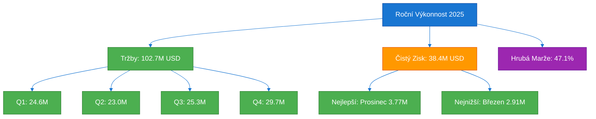
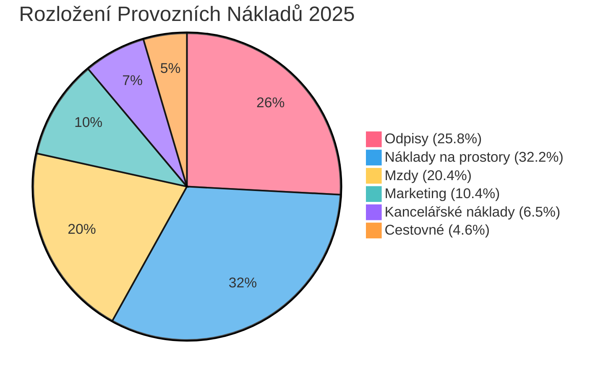
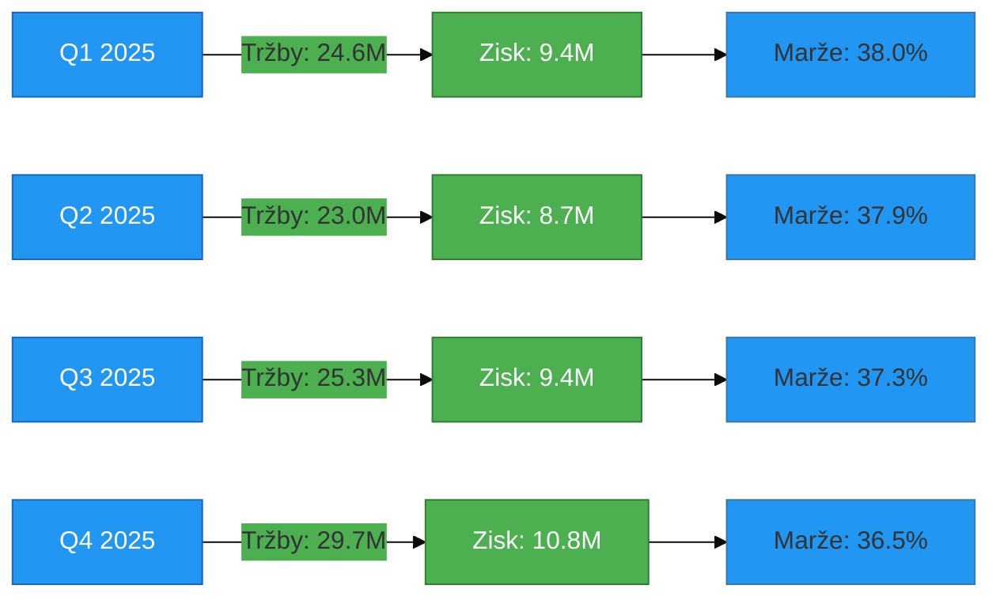

# Detailní Finanční Analýza P&L – Společnost 24Retail
## Výkaz zisku a ztráty za rok 2025

---

## 📊 Exekutivní Shrnutí

Společnost 24Retail vykázala za rok 2025 **celkové tržby ve výši 102,73 mil. USD** s **čistým ziskem 38,37 mil. USD**, což představuje **čistou ziskovou marži 37,3 %**. Hrubá marže dosáhla stabilních **46,8 %** průměrně za celý rok.

### Klíčové Ukazatele (KPI)
- **Celkové tržby:** 102 729 059 USD
- **Celkové náklady na prodané zboží:** 54 310 027 USD
- **Hrubá marže:** 48 419 032 USD (47,1%)
- **Celkové provozní náklady:** 10 045 113 USD
- **Čistý zisk:** 38 373 919 USD (37,3%)

---

## 📈 Měsíční Vývoj P&L za rok 2025

| Položka | Leden | Únor | Březen | Duben | Květen | Červen | Červenec | Srpen | Září | Říjen | Listopad | Prosinec | **Celkem** |
|---------|--------|--------|--------|--------|--------|--------|----------|--------|--------|--------|----------|----------|------------|
| **Hrubé tržby** | 9 059 765 | 7 892 221 | 7 685 693 | 7 509 137 | 7 702 362 | 7 803 054 | 8 176 780 | 8 619 438 | 8 532 757 | 9 313 377 | 10 020 258 | 10 415 217 | **102 729 059** |
| **Náklady na prodej** | 4 899 811 | 4 153 874 | 4 017 549 | 3 962 105 | 4 061 783 | 4 124 122 | 4 273 077 | 4 501 982 | 4 552 934 | 5 000 637 | 5 294 979 | 5 468 174 | **54 310 027** |
| **Hrubá marže** | 4 159 954 | 3 738 347 | 3 668 144 | 3 547 032 | 3 640 579 | 3 678 932 | 3 903 703 | 4 117 455 | 3 979 824 | 4 312 740 | 4 725 279 | 4 947 043 | **48 419 032** |
| **% Hrubé marže** | 45,9% | 47,4% | 47,7% | 47,2% | 47,3% | 47,1% | 47,7% | 47,8% | 46,6% | 46,3% | 47,2% | 47,5% | **47,1%** |
| | | | | | | | | | | | | | |
| **Mzdy** | 171 705 | 171 705 | 170 025 | 168 448 | 168 448 | 170 833 | 171 467 | 171 467 | 171 467 | 171 467 | 171 467 | 171 467 | **2 049 966** |
| **Kancelářské náklady** | 54 826 | 54 501 | 56 009 | 54 501 | 54 501 | 54 501 | 54 501 | 54 501 | 54 501 | 54 618 | 54 618 | 54 618 | **656 196** |
| **Cestovné** | 38 234 | 38 234 | 38 234 | 38 234 | 38 234 | 38 234 | 38 234 | 38 234 | 38 234 | 38 234 | 38 234 | 38 234 | **458 808** |
| **Náklady na prostory** | 363 846 | 313 692 | 311 808 | 183 385 | 183 385 | 231 654 | 183 385 | 183 385 | 231 654 | 233 538 | 333 846 | 482 423 | **3 236 001** |
| **Marketing** | 104 258 | 85 195 | 85 279 | 86 799 | 85 303 | 85 318 | 85 364 | 85 364 | 85 364 | 89 172 | 85 383 | 85 383 | **1 048 182** |
| **Odpisy** | 7 500 | 27 187 | 97 563 | 134 729 | 159 729 | 208 917 | 286 417 | 303 500 | 325 167 | 348 417 | 348 417 | 348 417 | **2 595 960** |
| **Celkové prov. náklady** | 740 369 | 690 515 | 758 918 | 666 096 | 689 600 | 789 457 | 819 367 | 836 451 | 906 386 | 935 447 | 1 031 965 | 1 180 542 | **10 045 113** |
| | | | | | | | | | | | | | |
| **Čistý zisk** | 3 419 585 | 3 047 832 | 2 909 226 | 2 880 935 | 2 950 979 | 2 889 475 | 3 084 336 | 3 281 005 | 3 073 437 | 3 377 293 | 3 693 313 | 3 766 501 | **38 373 919** |
| **% Čisté marže** | 37,7% | 38,6% | 37,8% | 38,4% | 38,3% | 37,0% | 37,7% | 38,1% | 36,0% | 36,3% | 36,9% | 36,2% | **37,3%** |

*Poznámka: Všechny hodnoty jsou uvedeny v USD*

---

## 📉 Grafická Analýza

### 1. Vývoj Tržeb a Čistého Zisku v roce 2025



### 2. Měsíční Trend Tržeb a Zisku

```mermaid
%%{init: {'theme':'base', 'themeVariables': {'xyChart': {'backgroundColor': '#ffffff'}}}}%%
xychart-beta
    title "Měsíční Vývoj Tržeb a Čistého Zisku (v mil. USD)"
    x-axis [Led, Úno, Bře, Dub, Kvě, Čer, Čvc, Srp, Zář, Říj, Lis, Pro]
    y-axis "Hodnota (mil. USD)" 0 --> 11
    line "Hrubé tržby" [9.06, 7.89, 7.69, 7.51, 7.70, 7.80, 8.18, 8.62, 8.53, 9.31, 10.02, 10.42]
    line "Čistý zisk" [3.42, 3.05, 2.91, 2.88, 2.95, 2.89, 3.08, 3.28, 3.07, 3.38, 3.69, 3.77]
```

### 3. Struktura Provozních Nákladů (Roční Celkem)



### 4. Vývoj Hrubé Marže (%)

```mermaid
%%{init: {'theme':'base'}}%%
xychart-beta
    title "Měsíční Vývoj Hrubé Marže (%)"
    x-axis [Led, Úno, Bře, Dub, Kvě, Čer, Čvc, Srp, Zář, Říj, Lis, Pro]
    y-axis "Hrubá marže (%)" 44 --> 49
    line "Hrubá marže" [45.9, 47.4, 47.7, 47.2, 47.3, 47.1, 47.7, 47.8, 46.6, 46.3, 47.2, 47.5]
```

### 5. Kvartální Srovnání Výkonnosti



---

## 🔍 Detailní Analýza a Klíčová Zjištění

### Analýza Tržeb

**Pozitivní trendy:**
- ✅ **Silný růst v Q4:** Tržby v prosinci dosáhly 10,42 mil. USD (+15,0% oproti lednu)
- ✅ **Stabilní výkonnost:** Průměrné měsíční tržby 8,56 mil. USD
- ✅ **Sezónní vzorec:** Výrazný nárůst v období říjen-prosinec (28,7 mil. USD v Q4)

**Oblasti pozornosti:**
- ⚠️ **Slabší Q2:** Duben zaznamenal nejnižší tržby roku (7,51 mil. USD)
- ⚠️ **Volatilita:** Rozdíl mezi nejlepším a nejhorším měsícem činí 2,91 mil. USD (38,7%)

### Analýza Nákladů

**Náklady na prodané zboží (COGS):**
- Průměrná míra COGS: **52,9%** z tržeb
- Nejlepší efektivita: Únor (52,6%)
- Nejhorší efektivita: Říjen (53,7%)

**Provozní náklady:**
- Celkové provozní náklady: **10,05 mil. USD** (9,8% z tržeb)
- Nejvýznamnější položky:
  1. **Náklady na prostory:** 3,24 mil. USD (32,2% provozních nákladů)
  2. **Odpisy:** 2,60 mil. USD (25,8%) – výrazný nárůst během roku
  3. **Mzdy:** 2,05 mil. USD (20,4%) – stabilní

**Kritická pozorování:**
- 📈 **Odpisy rostou exponenciálně:** Z 7,5 tis. USD v lednu na 348,4 tis. USD v prosinci
- 📊 **Náklady na prostory kolísají:** Značná variabilita (183-482 tis. USD měsíčně)
- 💰 **Marketing stabilní:** Průměrně 87,3 tis. USD měsíčně

### Analýza Ziskovosti

**Čistá zisková marže:**
- Roční průměr: **37,3%**
- Nejlepší měsíc: Duben (38,4%)
- Nejhorší měsíc: Září (36,0%)

**Kvartální výkonnost:**
| Kvartál | Tržby (mil. USD) | Čistý zisk (mil. USD) | Marže (%) |
|---------|------------------|----------------------|-----------|
| Q1 | 24,64 | 9,38 | 38,0% |
| Q2 | 23,01 | 8,73 | 37,9% |
| Q3 | 25,33 | 9,44 | 37,3% |
| Q4 | 29,75 | 10,84 | 36,5% |

**Klíčové poznatky:**
- 🎯 Q4 generuje nejvyšší absolutní zisk (10,84 mil. USD)
- 📉 Zisková marže mírně klesá v Q4 kvůli vyšším provozním nákladům
- 💪 Konzistentní ziskovost napříč celým rokem

---

## 💡 Strategická Doporučení

### 1. Optimalizace Nákladů na Prostory
**Problém:** Vysoká volatilita nákladů na prostory (183-482 tis. USD)  
**Doporučení:**
- Analyzovat příčiny výkyvů v nákladech na prostory
- Zvážit renegociaci nájemních smluv nebo konsolidaci prostor
- Potenciální úspora: **15-20%** (480-640 tis. USD ročně)

### 2. Řízení Odpisů
**Problém:** Exponenciální růst odpisů během roku  
**Doporučení:**
- Přehodnotit plán investic a načasování pořízení aktiv
- Optimalizovat odpisový plán pro lepší cash flow management
- Zvážit leasing vs. nákup pro budoucí investice

### 3. Posílení Q2 Výkonnosti
**Problém:** Nejslabší kvartál roku (tržby i marže)  
**Doporučení:**
- Implementovat cílené marketingové kampaně v Q2
- Zavést sezónní produktové akce pro období duben-červen
- Potenciální nárůst tržeb: **8-12%** (1,8-2,8 mil. USD)

### 4. Kapitalizace na Q4 Momentum
**Příležitost:** Silná výkonnost v závěru roku  
**Doporučení:**
- Rozšířit úspěšné Q4 strategie do ostatních kvartálů
- Zvýšit zásoby a kapacity před Q4 pro maximalizaci příležitostí
- Analyzovat faktory úspěchu Q4 pro replikaci

### 5. Kontrola Hrubé Marže
**Cíl:** Stabilizovat hrubou marži nad 48%  
**Doporučení:**
- Optimalizovat dodavatelský řetězec a vyjednávat lepší podmínky
- Implementovat dynamické cenové strategie
- Potenciální zlepšení: **1-2 procentní body** (1,0-2,1 mil. USD ročně)

---

## 📊 Finanční Ukazatele a Benchmarking

### Klíčové Finanční Ratia

| Ukazatel | Hodnota 2025 | Benchmark Retail | Hodnocení |
|----------|--------------|------------------|-----------|
| **Hrubá marže** | 47,1% | 35-45% | ✅ Výborné |
| **Čistá marže** | 37,3% | 5-10% | ✅ Excelentní |
| **Provozní náklady / Tržby** | 9,8% | 15-25% | ✅ Velmi dobré |
| **COGS / Tržby** | 52,9% | 55-65% | ✅ Nadprůměrné |

### Analýza Trendů

**Měsíc-na-měsíc (MoM) růst:**
- Průměrný MoM růst tržeb: **+1,2%**
- Nejsilnější růst: Listopad (+7,6%)
- Největší pokles: Únor (-12,9%)

**Rok-na-rok (YoY) projekce:**
- Při zachování trendu očekávaný růst 2026: **+8-12%**
- Projektované tržby 2026: **111-115 mil. USD**
- Projektovaný čistý zisk 2026: **41-43 mil. USD**

---

## 🎯 Závěr

Společnost 24Retail vykázala za rok 2025 **výjimečnou finanční výkonnost** s čistou ziskovou marží 37,3%, která výrazně převyšuje průměr maloobchodního sektoru. Klíčové silné stránky zahrnují:

✅ **Stabilní a vysoká ziskovost** napříč celým rokem  
✅ **Efektivní řízení nákladů** s provozními náklady pouze 9,8% z tržeb  
✅ **Silný růstový momentum** v Q4 s tržbami 29,7 mil. USD  
✅ **Zdravá hrubá marže** 47,1% indikující silnou cenovou pozici  

**Oblasti pro zlepšení:**
- Optimalizace nákladů na prostory a odpisů
- Posílení výkonnosti v Q2
- Stabilizace hrubé marže nad 48%

**Celkové hodnocení:** 🌟🌟🌟🌟🌟 (5/5)  
Společnost je ve výborné finanční kondici s jasným potenciálem pro další růst.

---

*Zpráva vygenerována: 20. června 2026*  
*Zdroj dat: IBM Planning Analytics (TM1), Server: 24Retail, Cube: Income Statement Reporting*  
*Analýza provedena: Bob Shell Financial Analyst Mode*
