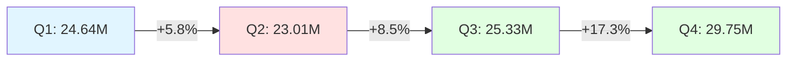
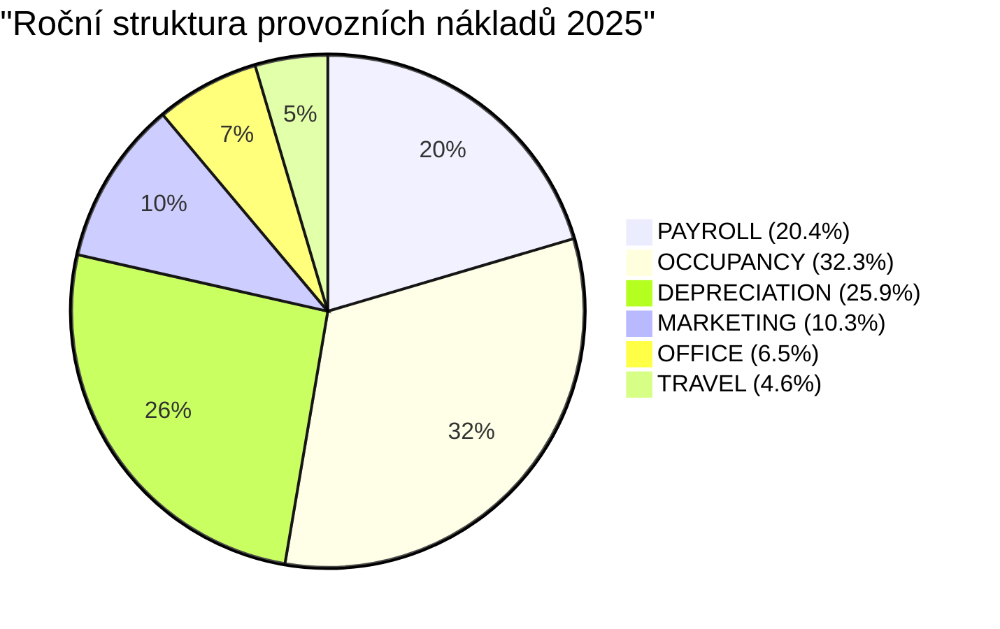

# Detailní rozbor P&L společnosti za rok 2025
## Income Statement Reporting - 24Retail

---

## 📊 Executive Summary

Společnost vykázala za rok 2025 celkové tržby ve výši **102,73 mil.** s čistým ziskem **37,37 mil.**, což představuje čistou ziskovou marži **36,4%**. Nejvyšší tržby byly zaznamenány v prosinci (10,42 mil.), nejnižší v březnu (7,69 mil.).

---

## 📈 Měsíční vývoj klíčových ukazatelů

### Kompletní P&L výkaz (v USD)

| Položka | Leden | Únor | Březen | Duben | Květen | Červen | Červenec | Srpen | Září | Říjen | Listopad | Prosinec | **CELKEM** |
|---------|--------|--------|--------|--------|--------|--------|----------|--------|--------|--------|----------|----------|------------|
| **Gross Revenue** | 9,059,765 | 7,892,221 | 7,685,693 | 7,509,137 | 7,702,362 | 7,803,054 | 8,176,780 | 8,619,438 | 8,532,757 | 9,313,377 | 10,020,258 | 10,415,217 | **102,729,059** |
| **Cost of Sales** | 4,899,811 | 4,153,874 | 4,017,549 | 3,962,105 | 4,061,783 | 4,124,122 | 4,273,077 | 4,501,982 | 4,552,934 | 5,000,637 | 5,294,979 | 5,468,174 | **54,311,027** |
| **Gross Margin** | 4,159,954 | 3,738,347 | 3,668,144 | 3,547,032 | 3,640,579 | 3,678,932 | 3,903,703 | 4,117,455 | 3,979,824 | 4,312,740 | 4,725,279 | 4,947,043 | **48,418,032** |
| **Gross Margin %** | 45.9% | 47.4% | 47.7% | 47.2% | 47.3% | 47.1% | 47.7% | 47.8% | 46.6% | 46.3% | 47.2% | 47.5% | **47.1%** |
| | | | | | | | | | | | | | |
| **Operating Expenses:** | | | | | | | | | | | | | |
| PAYROLL | 171,705 | 171,705 | 170,025 | 168,448 | 168,448 | 170,833 | 171,467 | 171,467 | 171,467 | 171,467 | 171,467 | 171,467 | **2,049,966** |
| OFFICE EXPENSE | 54,826 | 54,501 | 56,009 | 54,501 | 54,501 | 54,501 | 54,501 | 54,501 | 54,501 | 54,618 | 54,618 | 54,618 | **656,196** |
| TRAVEL | 38,234 | 38,234 | 38,234 | 38,234 | 38,234 | 38,234 | 38,234 | 38,234 | 38,234 | 38,234 | 38,234 | 38,234 | **458,808** |
| OCCUPANCY | 363,846 | 313,692 | 311,808 | 183,385 | 183,385 | 231,654 | 183,385 | 183,385 | 231,654 | 233,538 | 333,846 | 482,423 | **3,236,001** |
| MARKETING | 104,258 | 85,195 | 85,279 | 86,799 | 85,303 | 85,318 | 85,364 | 85,364 | 85,364 | 89,172 | 85,383 | 85,383 | **1,038,182** |
| DEPRECIATION | 7,500 | 27,187 | 97,563 | 134,729 | 159,729 | 208,917 | 286,417 | 303,500 | 325,167 | 348,417 | 348,417 | 348,417 | **2,595,960** |
| **Total OpEx** | 740,369 | 690,515 | 758,918 | 666,096 | 689,600 | 789,457 | 819,367 | 836,451 | 906,386 | 935,447 | 1,031,965 | 1,180,542 | **10,035,113** |
| | | | | | | | | | | | | | |
| **Net Profit** | 3,419,585 | 3,047,832 | 2,909,226 | 2,880,935 | 2,950,979 | 2,889,475 | 3,084,336 | 3,281,005 | 3,073,437 | 3,377,293 | 3,693,313 | 3,766,501 | **37,373,917** |
| **Net Margin %** | 37.7% | 38.6% | 37.9% | 38.4% | 38.3% | 37.0% | 37.7% | 38.1% | 36.0% | 36.3% | 36.9% | 36.2% | **36.4%** |

---

## 📉 Analýza trendů a klíčová zjištění

### 1. Vývoj tržeb (Gross Revenue)



**Klíčové poznatky:**
- **Q1 (Leden-Březen):** Silný start v lednu (9,06 mil.), následovaný poklesem v únoru (-12,9%) a březnu (-2,6%)
- **Q2 (Duben-Červen):** Nejslabší čtvrtletí roku s průměrnými měsíčními tržbami 7,67 mil.
- **Q3 (Červenec-Září):** Oživení růstu, průměr 8,44 mil./měsíc
- **Q4 (Říjen-Prosinec):** Nejsilnější čtvrtletí, vrchol v prosinci (10,42 mil.)

### 2. Vývoj čistého zisku (Net Profit)

```mermaid
xychart-beta
    title "Měsíční čistý zisk 2025 (mil. USD)"
    x-axis [Led, Úno, Bře, Dub, Kvě, Čer, Čvc, Srp, Zář, Říj, Lis, Pro]
    y-axis "Zisk (mil.)" 2.5 --> 4.0
    line [3.42, 3.05, 2.91, 2.88, 2.95, 2.89, 3.08, 3.28, 3.07, 3.38, 3.69, 3.77]
```

**Analýza ziskovosti:**
- Nejnižší zisk v dubnu (2,88 mil.) - kombinace nižších tržeb a stabilních nákladů
- Nejlepší měsíc: prosinec (3,77 mil.) - vysoké tržby při kontrolovaných nákladech
- Průměrný měsíční zisk: **3,11 mil.**
- Volatilita zisku: relativně stabilní s odchylkou ±10%

### 3. Struktura nákladů



**Nákladová analýza:**
- **Největší položka:** OCCUPANCY (32,3%) - výrazné výkyvy během roku
- **Druhá největší:** DEPRECIATION (25,9%) - progresivní růst během roku (z 7,5k na 348k/měsíc)
- **PAYROLL:** Stabilní na úrovni ~171k/měsíc (20,4% celkových OpEx)
- **Variabilní náklady:** MARKETING a TRAVEL relativně konstantní

### 4. Marže a rentabilita

```mermaid
xychart-beta
    title "Vývoj marží v roce 2025 (%)"
    x-axis [Led, Úno, Bře, Dub, Kvě, Čer, Čvc, Srp, Zář, Říj, Lis, Pro]
    y-axis "Marže (%)" 35 --> 50
    line [45.9, 47.4, 47.7, 47.2, 47.3, 47.1, 47.7, 47.8, 46.6, 46.3, 47.2, 47.5]
    line [37.7, 38.6, 37.9, 38.4, 38.3, 37.0, 37.7, 38.1, 36.0, 36.3, 36.9, 36.2]
```

**Marže:**
- **Gross Margin:** Stabilní kolem 47% (rozmezí 45,9% - 47,8%)
- **Net Margin:** Průměr 36,4% s poklesem v Q4 kvůli rostoucím OpEx
- **Spread (Gross - Net):** ~10,7 p.b. - efektivní kontrola provozních nákladů

---

## 🔍 Detailní kvartální srovnání

| Ukazatel | Q1 | Q2 | Q3 | Q4 | Meziroční trend |
|----------|----|----|----|----|-----------------|
| **Tržby** | 24,637,679 | 23,014,553 | 25,328,975 | 29,748,852 | ↗️ +20.8% (Q4 vs Q1) |
| **Náklady prodeje** | 13,071,234 | 12,148,010 | 13,327,993 | 15,763,790 | ↗️ +20.6% |
| **Hrubá marže** | 11,566,445 | 10,866,543 | 12,000,982 | 13,985,062 | ↗️ +21.0% |
| **OpEx** | 2,189,802 | 2,145,153 | 2,562,204 | 3,147,954 | ↗️ +43.7% ⚠️ |
| **Čistý zisk** | 9,376,643 | 8,721,389 | 9,438,778 | 10,837,107 | ↗️ +15.6% |
| **Gross Margin %** | 47.0% | 47.2% | 47.4% | 47.0% | → Stabilní |
| **Net Margin %** | 38.1% | 37.9% | 37.3% | 36.4% | ↘️ -1.7 p.b. |

---

## ⚠️ Rizika a doporučení

### Identifikovaná rizika:

1. **Rostoucí odpisy (DEPRECIATION)**
   - Nárůst z 7,5k (leden) na 348k (prosinec) - **46× zvýšení**
   - Indikuje významné kapitálové investice v průběhu roku
   - Doporučení: Analyzovat ROI nových aktiv

2. **Volatilita nákladů na OCCUPANCY**
   - Výkyvy od 183k do 482k měsíčně
   - Možné sezónní faktory nebo jednorázové položky
   - Doporučení: Standardizovat alokaci nákladů

3. **Klesající čistá marže v Q4**
   - Navzdory nejvyšším tržbám pokles net margin na 36,4%
   - Příčina: Rychlejší růst OpEx (+43,7%) než tržeb (+20,8%)
   - Doporučení: Optimalizace nákladové struktury

### Pozitiva:

✅ **Stabilní hrubá marže** ~47% napříč celým rokem  
✅ **Silný růst tržeb** v Q4 (+29,7% vs Q2)  
✅ **Konzistentní ziskovost** - všechny měsíce ziskové  
✅ **Efektivní kontrola variabilních nákladů** (PAYROLL, TRAVEL)

---

## 📊 Měsíční dynamika (MoM změny)

```mermaid
xychart-beta
    title "Měsíční změna tržeb (MoM %)"
    x-axis [Úno, Bře, Dub, Kvě, Čer, Čvc, Srp, Zář, Říj, Lis, Pro]
    y-axis "Změna (%)" -15 --> 15
    bar [-12.9, -2.6, -2.3, 2.6, 1.3, 4.8, 5.4, -1.0, 9.1, 7.6, 3.9]
```

**Klíčové momenty:**
- **Největší pokles:** Únor (-12,9%) - post-lednový útlum
- **Největší růst:** Říjen (+9,1%) - začátek sezóny Q4
- **Stabilizace:** Červenec-Prosinec s konzistentním růstem

---

## 💡 Strategická doporučení

### Krátkodobá (0-3 měsíce):
1. **Audit odpisů** - Ověřit správnost účtování 46× nárůstu DEPRECIATION
2. **Optimalizace OCCUPANCY** - Standardizovat měsíční alokaci nákladů
3. **Analýza Q2 slabosti** - Identifikovat příčiny poklesu duben-červen

### Střednědobá (3-12 měsíců):
1. **Leverage Q4 momentum** - Replikovat úspěšné strategie z Q4 do Q1 2026
2. **Nákladová efektivita** - Cíl: Udržet OpEx růst pod růstem tržeb
3. **Marže management** - Stabilizovat net margin na 37-38%

### Dlouhodobá (12+ měsíců):
1. **Škálovatelnost** - Připravit infrastrukturu pro růst bez proporcionálního nárůstu OpEx
2. **Diverzifikace** - Snížit sezónní volatilitu tržeb
3. **Investiční strategie** - Vyhodnotit ROI kapitálových výdajů z roku 2025

---

## 📋 Závěr

Společnost vykázala za rok 2025 **solidní finanční výkon** s celkovými tržbami 102,73 mil. USD a čistým ziskem 37,37 mil. USD. Hrubá marže zůstala stabilní na úrovni 47%, což svědčí o efektivním řízení nákladů na prodej.

**Hlavní výzvy:**
- Exponenciální růst odpisů vyžaduje důkladnou analýzu
- Klesající čistá marže v Q4 navzdory rekordním tržbám
- Vysoká volatilita nákladů na OCCUPANCY

**Příležitosti:**
- Silný momentum v Q4 lze využít pro růst v roce 2026
- Stabilní hrubá marže poskytuje prostor pro investice
- Konzistentní ziskovost umožňuje strategické plánování

---

*Analýza vytvořena: 20. června 2026*  
*Zdroj dat: IBM Planning Analytics (TM1) - Server 24Retail, Cube: Income Statement Reporting*  
*Všechny částky v USD, zaokrouhleno na celé dolary*