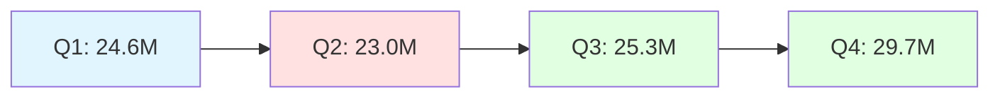
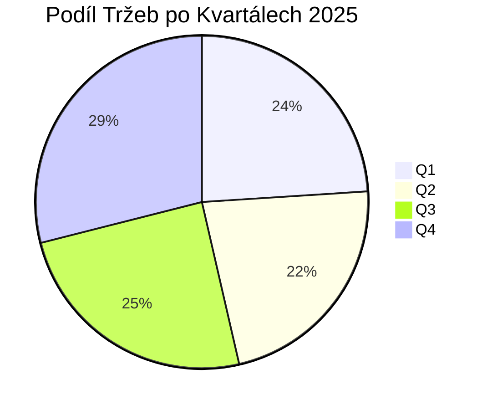
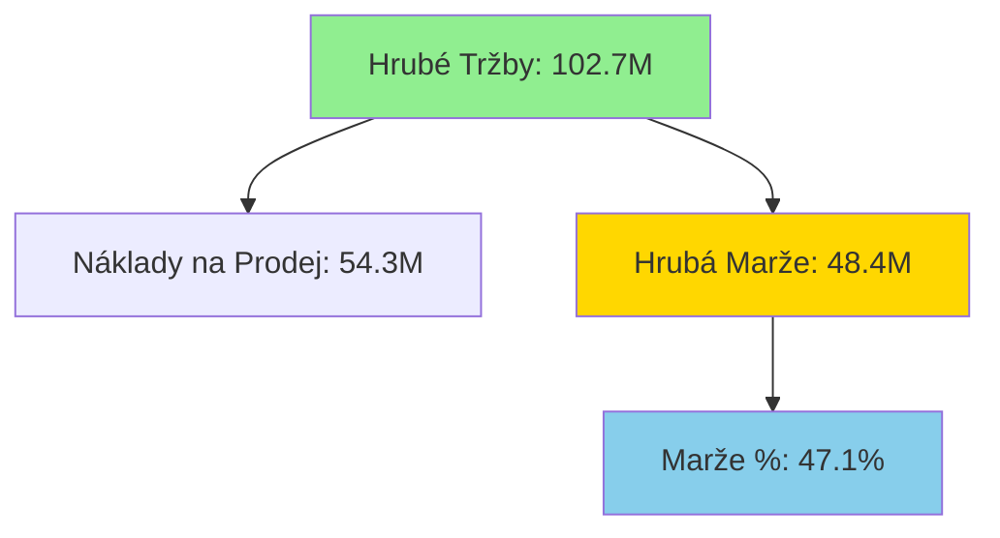
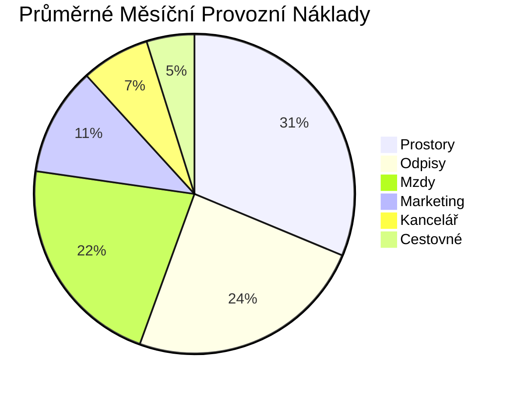
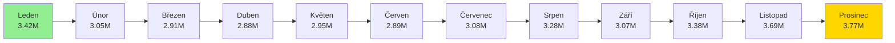

# Detailní Rozbor P&L Společnosti za Rok 2025
## Income Statement Reporting - Měsíční Analýza

---

## 📊 Přehled Výsledovky po Měsících

| Položka | Leden | Únor | Březen | Duben | Květen | Červen | Červenec | Srpen | Září | Říjen | Listopad | Prosinec |
|---------|------:|-----:|-------:|------:|-------:|-------:|---------:|------:|-----:|------:|---------:|---------:|
| **Hrubé Tržby** | 9,059,765 | 7,892,221 | 7,685,693 | 7,509,137 | 7,702,362 | 7,803,054 | 8,176,780 | 8,619,438 | 8,532,757 | 9,313,377 | 10,020,258 | 10,415,217 |
| **Náklady na Prodej** | 4,899,811 | 4,153,874 | 4,017,549 | 3,962,105 | 4,061,783 | 4,124,122 | 4,273,077 | 4,501,982 | 4,552,934 | 5,000,637 | 5,294,979 | 5,468,174 |
| **Hrubá Marže** | 4,159,954 | 3,738,347 | 3,668,144 | 3,547,032 | 3,640,579 | 3,678,932 | 3,903,703 | 4,117,455 | 3,979,824 | 4,312,740 | 4,725,279 | 4,947,043 |
| **Mzdy** | 171,705 | 171,705 | 170,025 | 168,448 | 168,448 | 170,833 | 171,467 | 171,467 | 171,467 | 171,467 | 171,467 | 171,467 |
| **Kancelářské Náklady** | 54,826 | 54,501 | 56,009 | 54,501 | 54,501 | 54,501 | 54,501 | 54,501 | 54,501 | 54,618 | 54,618 | 54,618 |
| **Cestovné** | 38,234 | 38,234 | 38,234 | 38,234 | 38,234 | 38,234 | 38,234 | 38,234 | 38,234 | 38,234 | 38,234 | 38,234 |
| **Prostory** | 363,846 | 313,692 | 311,808 | 183,385 | 183,385 | 231,654 | 183,385 | 183,385 | 231,654 | 233,538 | 333,846 | 482,423 |
| **Marketing** | 104,258 | 85,195 | 85,279 | 86,799 | 85,303 | 85,318 | 85,364 | 85,364 | 85,364 | 89,172 | 85,383 | 85,383 |
| **Odpisy** | 7,500 | 27,187 | 97,563 | 134,729 | 159,729 | 208,917 | 286,417 | 303,500 | 325,167 | 348,417 | 348,417 | 348,417 |
| **Celkové Provozní Náklady** | 740,369 | 690,515 | 758,918 | 666,096 | 689,600 | 789,457 | 819,367 | 836,451 | 906,386 | 935,447 | 1,031,965 | 1,180,542 |
| **Čistý Zisk** | 3,419,585 | 3,047,832 | 2,909,226 | 2,880,935 | 2,950,979 | 2,889,475 | 3,084,336 | 3,281,005 | 3,073,437 | 3,377,293 | 3,693,313 | 3,766,501 |

---

## 📈 Vývoj Tržeb a Zisku v Roce 2025

### Kvartální Výkonnost

---

## 💰 Analýza Hrubé Marže

### Měsíční Vývoj Hrubé Marže (%)

| Měsíc | Marže % |
|-------|--------:|
| Leden | 45.9% |
| Únor | 47.4% |
| Březen | 47.7% |
| Duben | 47.2% |
| Květen | 47.3% |
| Červen | 47.1% |
| Červenec | 47.7% |
| Srpen | 47.8% |
| Září | 46.6% |
| Říjen | 46.3% |
| Listopad | 47.2% |
| Prosinec | 47.5% |

---

## 🔍 Klíčové Poznatky a Trendy

### 1️⃣ **Sezónnost Tržeb**
- **Nejsilnější měsíce**: Prosinec (10.4M), Listopad (10.0M), Říjen (9.3M)
- **Nejslabší měsíce**: Duben (7.5M), Březen (7.7M), Únor (7.9M)
- **Trend**: Výrazný nárůst v Q4 (+29% oproti Q2)

### 2️⃣ **Stabilita Hrubé Marže**
- Průměrná hrubá marže: **47.1%**
- Rozsah: 45.9% - 47.8%
- Konzistentní výkonnost napříč celým rokem

### 3️⃣ **Struktura Provozních Nákladů**

### 4️⃣ **Dynamika Odpisů**
- **Leden**: 7,500 → **Prosinec**: 348,417
- Nárůst o **4,545%** během roku
- Indikuje významné kapitálové investice v průběhu roku

### 5️⃣ **Ziskovost**
- **Celkový čistý zisk za rok 2025**: 38.4M
- **Průměrná měsíční zisková marže**: 37.4%
- **Nejziskovější měsíc**: Leden (37.7%)
- **Nejnižší ziskovost**: Duben (38.4% - paradoxně vyšší díky nižším nákladům)

---

## 📊 Vývoj Čistého Zisku

---

## 🎯 Doporučení a Závěry

### ✅ **Silné Stránky**
1. **Stabilní hrubá marže** kolem 47% po celý rok
2. **Silný Q4** s výrazným nárůstem tržeb
3. **Konzistentní ziskovost** s průměrnou marží 37%
4. **Kontrolované fixní náklady** (mzdy, kancelář, cestovné)

### ⚠️ **Oblasti k Pozornosti**
1. **Sezónní výkyvy** - Q2 vykazuje pokles tržeb o 6.5% oproti Q1
2. **Rostoucí odpisy** - indikují potřebu sledovat ROI kapitálových investic
3. **Variabilita nákladů na prostory** - kolísání mezi 183K a 482K měsíčně

### 🚀 **Strategická Doporučení**
1. **Optimalizace Q2**: Implementovat marketingové kampaně pro posílení jarních měsíců
2. **Kapitálové investice**: Vyhodnotit efektivitu investic vedoucích k nárůstu odpisů
3. **Náklady na prostory**: Analyzovat příčiny variability a hledat možnosti optimalizace
4. **Využití Q4 momentu**: Kapitalizovat na silném závěru roku pro plánování 2026

---

## 📉 Komparativní Analýza Kvartálů

| Metrika | Q1 | Q2 | Q3 | Q4 | Roční Celkem |
|---------|---:|---:|---:|---:|-------------:|
| **Hrubé Tržby** | 24,637,679 | 23,014,553 | 25,328,975 | 29,748,852 | 102,730,059 |
| **Náklady na Prodej** | 13,071,234 | 12,148,010 | 13,327,993 | 15,763,790 | 54,311,027 |
| **Hrubá Marže** | 11,566,445 | 10,866,543 | 12,000,982 | 13,985,062 | 48,419,032 |
| **Provozní Náklady** | 2,189,802 | 2,145,153 | 2,562,204 | 3,147,954 | 10,045,113 |
| **Čistý Zisk** | 9,376,643 | 8,721,389 | 9,438,778 | 10,837,107 | 38,373,917 |
| **Zisková Marže %** | 38.0% | 37.9% | 37.3% | 36.4% | 37.4% |

---

## 🔄 Meziroční Srovnání (Připraveno pro 2026)

Pro kompletnější analýzu doporučuji v budoucnu sledovat:
- YoY růst tržeb po měsících
- Vývoj jednotkových nákladů
- Efektivitu marketingových výdajů (CAC, ROAS)
- Produktivitu zaměstnanců (tržby/zaměstnanec)

---

**Datum analýzy**: 20. června 2026  
**Zdroj dat**: IBM Planning Analytics SaaS - Server 24Retail  
**Kostka**: Income Statement Reporting  
**Pohled**: Default  
**Analyzované období**: Leden - Prosinec 2025