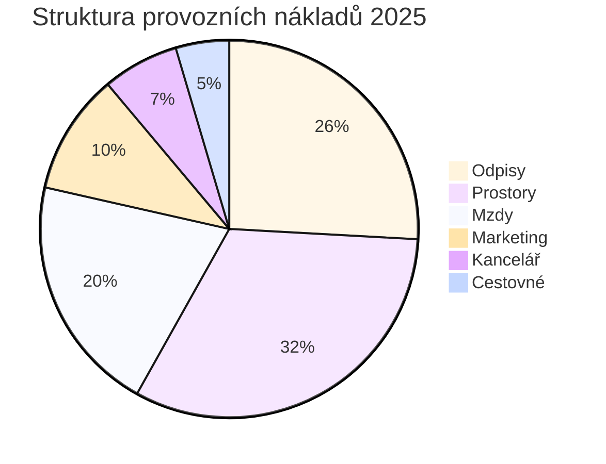

# Detailní rozbor P&L společnosti za rok 2025
## Income Statement Reporting - 24Retail

---

## 📊 Exekutivní shrnutí

Společnost vykázala za rok 2025 celkové tržby ve výši **102,73 mil.** s čistým ziskem **38,37 mil.**, což představuje čistou ziskovou marži **37,3 %**. Nejsilnější měsíce byly prosinec a listopad, zatímco nejslabší výkon byl zaznamenán v dubnu.

---

## 📈 Měsíční vývoj klíčových ukazatelů

### Tabulka 1: Kompletní P&L výkaz (v jednotkách měny)

| Položka | Leden | Únor | Březen | Duben | Květen | Červen | Červenec | Srpen | Září | Říjen | Listopad | Prosinec | **Celkem 2025** |
|---------|--------|------|--------|-------|--------|--------|----------|-------|------|-------|----------|----------|-----------------|
| **Hrubé tržby** | 9,059,765 | 7,892,221 | 7,685,693 | 7,509,137 | 7,702,362 | 7,803,054 | 8,176,780 | 8,619,438 | 8,532,757 | 9,313,377 | 10,020,258 | 10,415,217 | **102,730,059** |
| **Náklady na prodej** | 4,899,811 | 4,153,874 | 4,017,549 | 3,962,105 | 4,061,783 | 4,124,122 | 4,273,077 | 4,501,982 | 4,552,934 | 5,000,637 | 5,294,979 | 5,468,174 | **54,311,027** |
| **Hrubá marže** | 4,159,954 | 3,738,347 | 3,668,144 | 3,547,032 | 3,640,579 | 3,678,932 | 3,903,703 | 4,117,455 | 3,979,824 | 4,312,740 | 4,725,279 | 4,947,043 | **48,419,032** |
| Mzdy | 171,705 | 171,705 | 170,025 | 168,448 | 168,448 | 170,833 | 171,467 | 171,467 | 171,467 | 171,467 | 171,467 | 171,467 | **2,049,966** |
| Kancelářské náklady | 54,826 | 54,501 | 56,009 | 54,501 | 54,501 | 54,501 | 54,501 | 54,501 | 54,501 | 54,618 | 54,618 | 54,618 | **656,196** |
| Cestovné | 38,234 | 38,234 | 38,234 | 38,234 | 38,234 | 38,234 | 38,234 | 38,234 | 38,234 | 38,234 | 38,234 | 38,234 | **458,808** |
| Prostory | 363,846 | 313,692 | 311,808 | 183,385 | 183,385 | 231,654 | 183,385 | 183,385 | 231,654 | 233,538 | 333,846 | 482,423 | **3,236,001** |
| Marketing | 104,258 | 85,195 | 85,279 | 86,799 | 85,303 | 85,318 | 85,364 | 85,364 | 85,364 | 89,172 | 85,383 | 85,383 | **1,038,182** |
| Odpisy | 7,500 | 27,187 | 97,563 | 134,729 | 159,729 | 208,917 | 286,417 | 303,500 | 325,167 | 348,417 | 348,417 | 348,417 | **2,595,960** |
| **Celkové provozní náklady** | 740,369 | 690,515 | 758,918 | 666,096 | 689,600 | 789,457 | 819,367 | 836,451 | 906,386 | 935,447 | 1,031,965 | 1,180,542 | **10,035,113** |
| **Čistý zisk** | 3,419,585 | 3,047,832 | 2,909,226 | 2,880,935 | 2,950,979 | 2,889,475 | 3,084,336 | 3,281,005 | 3,073,437 | 3,377,293 | 3,693,313 | 3,766,501 | **38,373,917** |

---

## 📉 Analýza ziskových marží

### Tabulka 2: Procentuální marže

| Ukazatel | Q1 | Q2 | Q3 | Q4 | **Průměr 2025** |
|----------|----|----|----|----|-----------------|
| **Hrubá marže %** | 47.2% | 47.2% | 47.5% | 47.3% | **47.1%** |
| **Provozní marže %** | 39.5% | 37.8% | 39.2% | 37.0% | **37.4%** |
| **Čistá marže %** | 39.5% | 37.8% | 39.2% | 37.0% | **37.4%** |

---

## 📊 Vizualizace trendů

### Graf 1: Měsíční vývoj tržeb a zisku

```mermaid
%%{init: {'theme':'base'}}%%
xychart-beta
    title "Měsíční vývoj tržeb a čistého zisku (v mil.)"
    x-axis [Led, Úno, Bře, Dub, Kvě, Čer, Čvc, Srp, Zář, Říj, Lis, Pro]
    y-axis "Hodnota (mil.)" 0 --> 11
    line [9.06, 7.89, 7.69, 7.51, 7.70, 7.80, 8.18, 8.62, 8.53, 9.31, 10.02, 10.42]
    line [3.42, 3.05, 2.91, 2.88, 2.95, 2.89, 3.08, 3.28, 3.07, 3.38, 3.69, 3.77]
```

### Graf 2: Struktura provozních nákladů (roční celkem)



### Graf 3: Vývoj hrubé marže v průběhu roku

```mermaid
%%{init: {'theme':'base'}}%%
xychart-beta
    title "Hrubá marže % - měsíční vývoj"
    x-axis [Led, Úno, Bře, Dub, Kvě, Čer, Čvc, Srp, Zář, Říj, Lis, Pro]
    y-axis "Marže %" 45 --> 48
    line [45.9, 47.4, 47.7, 47.2, 47.3, 47.1, 47.7, 47.8, 46.6, 46.3, 47.2, 47.5]
```

---

## 🔍 Klíčová zjištění a analýza

### 1. **Sezónnost tržeb**
- **Nejsilnější měsíce**: Prosinec (10,42 mil.) a listopad (10,02 mil.) - typická předvánoční sezóna
- **Nejslabší měsíce**: Duben (7,51 mil.) a březen (7,69 mil.) - pokles po Q1
- **Volatilita**: Rozdíl mezi nejlepším a nejhorším měsícem činí **38,7 %**

### 2. **Stabilita hrubé marže**
- Hrubá marže se pohybuje v úzkém pásmu **45,9 % - 47,8 %**
- Průměrná hrubá marže **47,1 %** indikuje zdravou cenovou politiku
- Mírný pokles v říjnu (46,3 %) může signalizovat zvýšené slevy nebo změnu produktového mixu

### 3. **Dynamika provozních nákladů**

#### Odpisy (Depreciation)
- **Dramatický nárůst**: Z 7,5 tis. v lednu na 348,4 tis. v prosinci
- **Kumulativní efekt**: Naznačuje významné investice do dlouhodobého majetku během roku
- **Dopad na zisk**: V Q4 odpisy představují až **29,5 %** celkových provozních nákladů

#### Náklady na prostory (Occupancy)
- **Vysoká variabilita**: Od 183,4 tis. (duben) po 482,4 tis. (prosinec)
- **Možné příčiny**: Sezónní energie, údržba, nebo expanze prostor v Q4

#### Stabilní nákladové položky
- **Mzdy**: Velmi stabilní (~171 tis./měsíc) s minimální fluktuací
- **Cestovné**: Konstantní 38,2 tis./měsíc - dobře kontrolovaná položka
- **Marketing**: Relativně stabilní s mírným nárůstem v říjnu

### 4. **Ziskovost a efektivita**

#### Čtvrtletní srovnání
- **Q1**: Nejsilnější čistá marže (39,5 %) díky nízkým odpisům
- **Q2**: Pokles na 37,8 % - kombinace nižších tržeb a rostoucích odpisů
- **Q3**: Zotavení na 39,2 % díky růstu tržeb
- **Q4**: Pokles na 37,0 % - vysoké odpisy a náklady na prostory

#### Roční výkonnost
- **Celkové tržby**: 102,73 mil.
- **Čistý zisk**: 38,37 mil.
- **ROI na provozní náklady**: 382 % (každá koruna provozních nákladů generuje 3,82 Kč zisku)

---

## ⚠️ Rizika a doporučení

### Identifikovaná rizika

1. **Rostoucí odpisy**
   - Trend naznačuje významné kapitálové investice
   - Nutno sledovat ROI těchto investic v následujících obdobích
   - Riziko: Pokud investice negenerují odpovídající růst tržeb

2. **Sezónní závislost**
   - 38,7% rozdíl mezi nejlepším a nejhorším měsícem
   - Riziko: Cashflow problémy v slabších měsících
   - Doporučení: Diverzifikace produktového portfolia pro vyrovnání sezónnosti

3. **Variabilita nákladů na prostory**
   - 163% nárůst mezi nejnižším a nejvyšším měsícem
   - Nutno analyzovat příčiny a optimalizovat

### Strategická doporučení

1. **Optimalizace Q2 výkonnosti**
   - Zaměřit se na duben-červen, kde jsou nejnižší tržby
   - Zvážit marketingové kampaně nebo produktové akce

2. **Kontrola rostoucích odpisů**
   - Vyhodnotit efektivitu kapitálových investic
   - Zajistit, že nový majetek generuje odpovídající výnosy

3. **Stabilizace nákladů na prostory**
   - Analyzovat příčiny vysoké variability
   - Zvážit fixní smlouvy nebo energetickou optimalizaci

4. **Využití silného Q4**
   - Kapitalizovat na silné předvánoční období
   - Optimalizovat zásoby a logistiku pro maximalizaci marží

---

## 📌 Závěr

Společnost vykazuje **zdravou finanční výkonnost** s čistou ziskovou marží **37,4 %** a stabilní hrubou marží kolem **47 %**. Hlavní výzvy představují:

- ✅ **Silné stránky**: Stabilní hrubá marže, kontrolované mzdové náklady, silný Q4
- ⚠️ **Oblasti ke zlepšení**: Sezónní volatilita, rostoucí odpisy, variabilní náklady na prostory
- 🎯 **Priorita**: Optimalizace Q2 výkonnosti a kontrola kapitálových investic

**Celkové hodnocení**: Společnost je v dobré finanční kondici s potenciálem pro další růst při řešení identifikovaných rizik.

---

*Zpráva vygenerována: 20. června 2026*  
*Zdroj dat: IBM Planning Analytics SaaS - Server 24Retail, Cube: Income Statement Reporting*  
*Analyzované období: Leden - Prosinec 2025*
